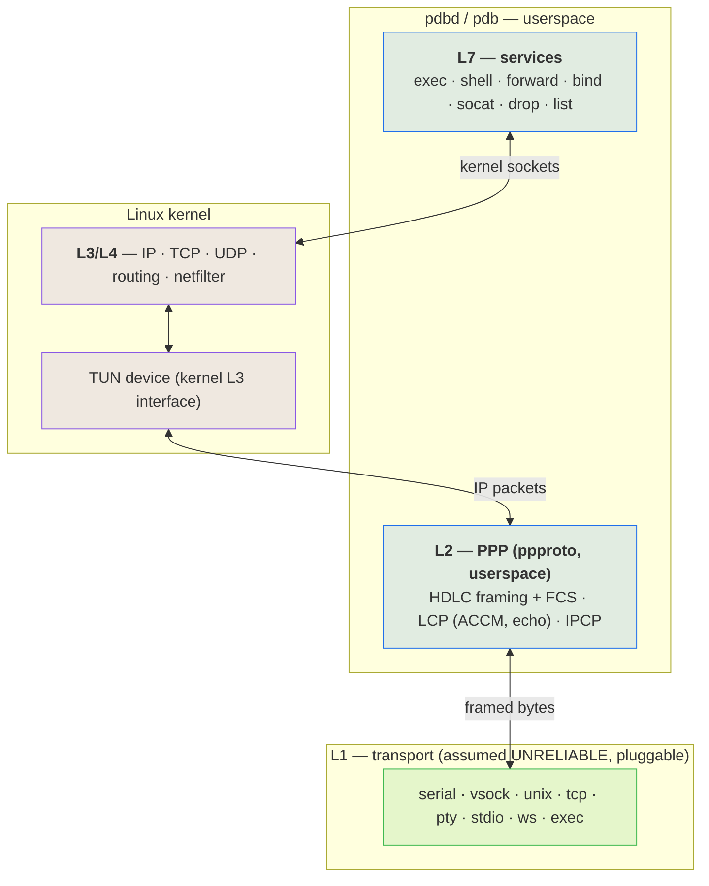
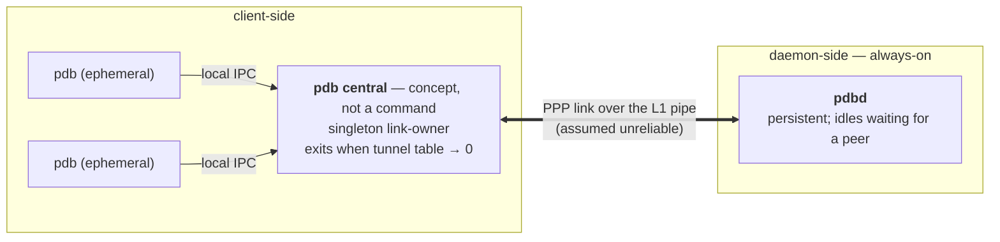
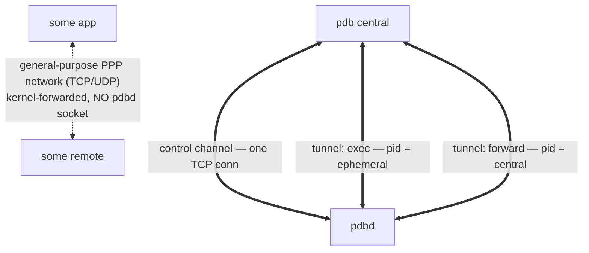
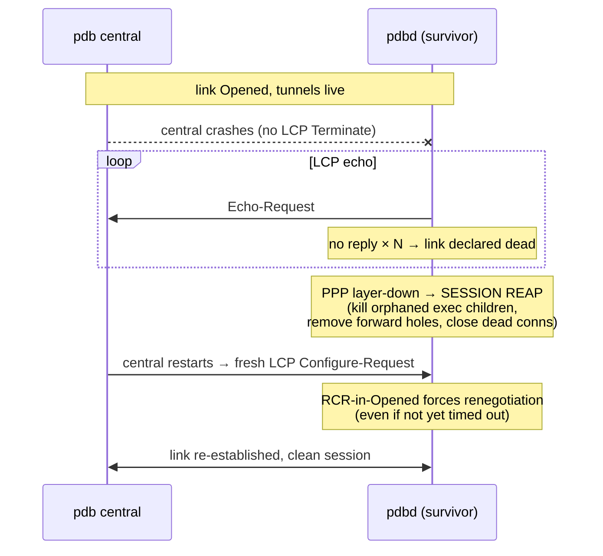

# pdbd

**A transport-agnostic, inject-and-play debug / RPC bridge — one daemon + one client that give you a reliable, multiplexed control channel, remote `execve`, and port-forwarding over *any* byte pipe, even when the pipe isn't reliable.**

> Status: **design / pre-implementation.** This README is the design spec. Nothing is built yet.

---

## Why this exists

Every tool that lets you reach into "the thing on the other side of a channel" is welded to *one* transport and *one* execution model:

| Tool | Transport | Execution |
| --- | --- | --- |
| `ssh` | TCP | shell / PTY |
| `adb` | USB / TCP | shell + `exec-out` |
| `qemu-guest-agent` | virtio-serial | `guest-exec` |
| `docker exec` | unix socket / API | shell / exec |

They solve the *same* problem — *run a process on the far side of a byte channel, forward some ports, maybe get an interactive shell* — four times, four ways, none of them interchangeable. And most of them are **shellful**, which is exactly why `ansible` and `terraform` fight their targets: a shell is not an RPC endpoint (quoting hell, `rc`/profile side-effects corrupting output, needs an interpreter on the target, no clean stdout/exit separation), and neither tool can reach a **console-only / serial** target at all.

`pdbd` collapses that into **one binary over "everything is a socket"**:

- **Any transport.** Serial, `vsock`, unix socket, TCP, a PTY, stdio, a websocket, or *any program's stdio* — selected with a [socat](https://www.redhat.com/en/blog/getting-started-socat)-style address.
- **Reliable even when the transport isn't.** The transport is assumed hostile and lossy *by construction* — a transport may be a noisy physical UART, a Serial-over-LAN link, or any channel that drops bytes, and "it happens to be a reliable `vsock` today" is never an assumption we're allowed to make. `pdbd` runs **PPP in userspace** to turn any dumb pipe into a real IP link, and lets the **kernel's TCP** carry reliability on top.
- **`execve`, not shell.** Structured `execve(argv[])` with stdio tunneled and a real exit code; a PTY *only* when you ask for `shell`. This is what makes it safe for automation and able to drive serial/console-only hosts the big tools can't.

`pdbd` is **transport- and OS-agnostic by design, meant to be reused across projects** — it is not built for any single one. The general job is **instrumenting and driving Linux images** — a VM guest, a container, or a bare-metal host — over whatever channel reaches them, including the awkward ones (a raw serial console, a Serial-over-LAN link) that `ssh`/`adb`/`docker exec` can't touch. The arc is a single bridge that unifies local-admin `ssh`, `adb`, guest agents, and `docker exec` — optimized for infrastructure use, over anything that looks like a socket.

---

## The layer model

The central idea: **`pdbd`/`pdb` own L1 (transport) and L2 (link), the kernel owns L3/L4 (IP/TCP/UDP), and `pdbd`/`pdb` own L7 (the services).** PPP in userspace bridges a dumb L1 pipe up to a kernel IP interface, so everything above L2 is *real kernel networking* — real sockets, real kernel TCP reliability, real `netfilter`.



### L1 — the transport (assumed unreliable, pluggable)

A dumb, bidirectional byte pipe. **We always treat it as lossy** — a transport may be a noisy physical UART or a Serial-over-LAN link that drops bytes, and a factually-reliable transport (a `vsock`, a unix socket) is never *assumed* reliable. The transport sits strictly *below* the tool.

Transports are named with a **socat / [websocat](https://docs.rs/websocat)-style address** whose `TYPE` encodes both the backend and the direction (connect vs listen), so no separate flags are needed:

```
--socket FILE:/dev/ttyS0,b115200,raw      # a physical UART / Serial-over-LAN device
--socket UNIX-CONNECT:/run/vm/guest.sock  # a VM host-end chardev socket
--socket VSOCK-CONNECT:3:9000             # vsock (cid:port)
--socket WS-LISTEN:0.0.0.0:8080           # websocket
--socket EXEC:'ssh jump nc target 23'     # ride the link over ANY program's stdio
--socket STDIO                            # ride stdio
```

Each `TYPE` maps to an existing `AsyncRead + AsyncWrite` backend (`tokio` TCP/unix, `tokio-serial`, `tokio-vsock`, `ws_stream_tungstenite`), so L1 is largely assembly. `EXEC:` is the sleeper feature — the link can ride over anything that produces a pipe.

### L2 — PPP, in userspace

[`ppproto`](https://docs.rs/ppproto)-style **sans-IO PPP** runs HDLC framing (+FCS), LCP, and IPCP entirely in userspace. This is the part that makes a *lossy* serial usable:

- **Self-synchronizing, error-detecting framing** (HDLC flags + byte-stuffing + FCS) — after a corrupted byte it resyncs on the next flag and drops the bad frame, where a length-prefix framing would desync permanently.
- **LCP ACCM** — escapes control bytes a terminal/SOL link would otherwise eat.
- **LCP echo** — detects a dead/half-open peer, keeps an idle link alive, and triggers recovery (see *lifecycle*).

The negotiated IP packets terminate into a **kernel TUN device** — so PPP is done in userspace, but *IP and everything above it is the kernel's*. This backend needs only `CONFIG_TUN` (not kernel PPP), which maximizes portability. A **kernel-PPP backend** (`/dev/ppp`, kernel-side framing) is a future drop-in for performance: it relocates L2 into the kernel without changing L3/L4, so nothing above it moves.

### L3 / L4 — the kernel

Because L2 terminates into a TUN, the kernel runs its full stack on the link: real sockets, routing, `netfilter`, and — crucially — **kernel TCP carries reliability over the lossy pipe.** A frame corrupted on the wire fails FCS and is dropped; the TCP segment it carried is never ACKed; kernel TCP retransmits it. This is how TCP-over-PPP survived noisy modem lines for decades. One system (kernel TCP) gives us reliability, ordering, flow control, fair-sharing across tunnels, *and* the connection-teardown signal our cleanup rides on.

**Address discovery is free:** IPCP conveys each end's address to the other as part of link bring-up (and supports dynamic assignment — the dial-up heritage). So a client learns the daemon's control address from its *own* completed IPCP, regardless of whether that address was user-assigned or kernel-negotiated. No out-of-band discovery.

Because L2 is PPP terminating into a kernel IP interface, the link is itself a **general-purpose PPP network** — it provides ordinary L3 (IP) traffic over non-conventional L1 transports, so `pdbd`'s debug tunnels are just *one* consumer of it and arbitrary IP traffic can ride the same link. **Multi-IP, policy-routing, and firewall zones** then fall out of the kernel L3 interface for free (`ip addr add`, `ip route`, `nft`). These are *latent* — not built in v0, but the architecture leaves the door open to carve the single link into firewalled policy zones (control, forward, and the general-purpose network) later.

### L7 — the services

`pdbd` is, above the link, an RPC/debug agent. Commands: `exec`, `shell`, `forward`, `bind`, `socat`, `drop`, `list`.

- **`exec` vs `shell`.** `exec` is a structured `execve(argv[])` with stdio tunneled and a real exit code — *no shell, no PTY* (the automation-friendly primitive, like `adb exec-out`). `shell` allocates a PTY (`adb shell` / `ssh -t`). Each invocation is a *fresh, isolated process*, which is what eliminates the dirty-state problem a single shared console would have.
- **One control channel, one TCP tunnel per command.** The control channel is a single connection carrying lightweight RPCs (start / drop / list). Each command gets its **own** TCP tunnel — a separate kernel TCP connection — *not* multiplexed streams on one connection. On a lossy link this deliberately avoids HTTP/2-style cross-stream head-of-line blocking (the QUIC-vs-HTTP/2 lesson): a stalled tunnel stalls only itself.

### Process model

`pdbd` is **multiprocess**, modeled on `sshd`/`adbd`:

- a **control-plane core** owns the single control channel and the link;
- **each debug tunnel is serviced concurrently and in isolation** — the daemon fans out per-tunnel work across worker processes (`sshd`'s process-per-connection; `adbd`'s per-stream model), so one tunnel can never stall or corrupt another, and a crashing tunnel can't take the core down;
- **`exec`/`shell` run as child processes** — a real `execve` per invocation, which is the isolation that makes every command fresh-state (no shared-shell carryover).

Concurrency within a process is `async` (tokio); isolation *between* tunnels is a process boundary. The split is deliberate: the core stays small and long-lived, while the volatile per-connection work lives in disposable workers.

---

## Topology & lifecycle

Modeled on `ssh`/`adb` — **client-side vs daemon-side**, never "host/guest" (on bare metal there is no host/guest, just two ends of a wire).



- **`pdbd`** — the daemon. **Always on**, daemon-side, idles waiting for a peer. It is the permanent endpoint.
- **`pdb`** — the client, in **two modes**. *`pdb central` is a concept/role, never a command you type:*
  - **ephemeral** — the per-command invocations you actually run (`pdb exec …`, `pdb forward …`).
  - **central** — a **singleton** client-side process that owns the PPP link. It exists so the expensive, fragile link is established *once* and amortized, never rebuilt per command.

**Orchestration.** You only ever invoke an *ephemeral* `pdb`. On start it finds the running **central**, or — if none exists — **auto-spawns one** (exactly as `adb` auto-starts its background server) and attaches to it. Every ephemeral shares that single central. There is no `pdb central` command; central is spawned, discovered, and reaped implicitly.

**IPC.** ephemeral ↔ central speak over a **local IPC socket** (a unix domain socket). central owns the one PPP link and the control channel to `pdbd`, and **multiplexes every ephemeral's requests onto it**; an ephemeral's `exec`/`shell` stdio streams ephemeral ↔ central ↔ tunnel ↔ `pdbd`. The ephemeral is a thin local client; central is where the link, the control channel, and the tunnel table live.

**Lifecycle.** central's lifetime is **refcounted to the tunnel table — not to the number of ephemerals.** It exits when the active-tunnel count drops to zero, which brings the link down. So a standing `forward`/`bind` (a tunnel *owned by central*) keeps central alive after the ephemeral that launched it has exited, while an `exec`/`shell` tunnel dies with its ephemeral. (An idle-linger grace before exit is an option, to keep a warm link across bursts of activity.)

### Tunnel ownership

**All** TCP — `pdbd`'s debug tunnels *and* other traffic on the general-purpose PPP network — rides the kernel's TCP/IP. The difference is not a layer; it's **which process holds the endpoint socket:**



- A **debug tunnel** is a connection `pdbd` holds the socket fd for (it `accept`ed or `connect`ed it, tagged it a tunnel-id). `pdbd` tracks exactly these.
- **General-purpose PPP-network** traffic is kernel-forwarded IP with **no `pdbd` socket** — it never enters `pdbd`'s table. It shows up only in the *kernel's* view (`ss` / `conntrack`).

Ownership needs no packet inspection: it's just "which fds does `pdbd` hold." The kernel does the TCP for everything regardless.

### Cleanup — reactive first, `drop` as a convenience

We never trust graceful signals (things die without notice). So the **kernel's TCP state is the cleanup oracle**: FIN / RST / keepalive-failure on a tunnel → `pdbd` reactively reaps that command's resources (kill the `exec` child, remove the `forward` hole). A **`drop <tunnel-id>`** command is the *explicit, graceful* teardown of a long-runner — it triggers the same reap path early, but it is **not** the safety net; the kernel is.

### Recovery from non-graceful termination

If `central` vanishes without an LCP Terminate (crash) while the pipe stays up, PPP is built to recover — it's the dial-up heritage:



Two native mechanisms do the heavy lifting: **LCP echo** detects the dead/half-open peer, and a **returning peer's Configure-Request forces renegotiation** even if the survivor hasn't timed out yet (RFC 1661 `RCR`-in-`Opened`). **PPP heals the *link*; `pdbd` heals the *session*** — it hooks PPP's layer-down event to reap orphaned children, firewall holes, and dead connections, so the returning `central` meets a clean daemon.

---

## Bootstrap & the control channel

- `pdbd` is already running. `pdb central` comes up, brings up the PPP link, and **learns `pdbd`'s control address from its own IPCP** — no fixed address required, no out-of-band discovery.
- The control service binds the **IPCP-primary address** so it's the one IPCP conveys. Port is a configurable default (overridable), with a tiny announce/discovery exchange as the dynamic-port fallback. "Fixed" is a *default*, never an *assumption*.
- `pdbd` **programs its own firewall hole** for the control port (it holds `CAP_NET_ADMIN`), so it doesn't fight the firewall — it configures it. Everything after the control channel (forwards, exec) is negotiated *over* the control channel and provisioned on demand.

---

## Crypto

**No crypto on trusted channels** (local serial / vsock / unix socket) — on a trusted point-to-point pipe it is pure overhead. Crypto/auth is a **pluggable transport-layer concern**: absent on trusted pipes, and expected (e.g. mutual-TLS) for networked transports. `pdbd` is therefore *not* a drop-in `ssh`-over-hostile-network replacement until that slot is filled; out of the box it unifies **trusted-channel** remote exec.

---

## Prior art

No single tool does what `pdbd` does — **transport-agnostic remote exec *and* a general IP path over the same arbitrary byte pipe** — but each half is well-trodden. Surveyed across languages (not just the C/Rust systems world) so we steal the right grammar rather than reinvent it.

**PPP, in userspace** — the L2 we need:

- [`ppproto`](https://docs.rs/ppproto) (Rust) — `no-std`, no-alloc, sans-IO PPP implementing RFC 1661 (LCP) + RFC 1332 (IPCP), tested against `pppd`. **Our starting point for L2** — sans-IO is exactly the shape that lets us feed it any transport.
- [Fuchsia PPP](https://fuchsia.googlesource.com/fuchsia/+/refs/heads/main/src/connectivity/ppp) (Rust) — PPP over serial with LCP/IPCP/IPv6CP; a fuller reference implementation.
- [`zouppp`](https://github.com/hujun-open/zouppp) (Go) — userspace PPP/PPPoE client with its own LCP/IPCP/IPv6CP state machines; the cleanest cross-language cross-check for our control-protocol logic.
- [`pppd`](https://github.com/ppp-project/ppp) (C) — the canonical reference for driving *kernel* PPP (GPLv2; we reimplement the grammar/behavior, never vendor the code, so `pdbd` stays permissively licensed).

**Userspace IP — the road not taken.** We terminate IP in the *kernel* via a TUN device (real sockets, kernel TCP reliability). The alternative — a userspace TCP/IP stack — is proven but heavier: [gVisor `netstack`](https://github.com/google/gvisor) (Go) and [`smoltcp`](https://docs.rs/smoltcp) (Rust). Recorded as the explicit fork in the design, not an oversight.

**Transport-agnostic remote exec / RPC** — the L7 we need:

- [`u-root`'s `cpu`](https://github.com/u-root/cpu) (Go) — plan9-`cpu`-inspired remote exec that carries namespaces over a flexible transport; **closest in spirit** to the exec half.
- [`gokrazy/breakglass`](https://github.com/gokrazy/breakglass) (Go) — inject a static binary into an otherwise-immutable appliance and get an interactive debug shell; the "break glass into a sealed image" use-case, which is exactly ours.
- [`eRPC` / EmbeddedRPC](https://github.com/EmbeddedRPC/erpc) (C/C++) — RPC explicitly decoupled from transport (serial, TCP, USB, RPMsg); the strongest prior art for *one RPC surface over many byte pipes*.
- [`citizenshell`](https://github.com/meuter/citizenshell) (Python) — one shell API over telnet / ssh / serial / adb; the clearest statement of the **unification** goal `pdbd` chases, from the scripting world.
- [Apache MINA SSHD](https://github.com/apache/mina-sshd) (Java) — a full SSH client+server *library* (not a CLI); the reference for SSH-as-embeddable-protocol rather than a daemon.

**L1 address grammar:**

- [`websocat`](https://docs.rs/websocat) / `socat` — socat-style address specifiers; the dialect reference for `pdbd`'s `--socket` L1 addresses (grammar *reimplemented*, never copied from GPL `socat`).

**The tools this unifies:** `adb`, `ssh`, `qemu-guest-agent`, `docker exec` — each solves one transport or one capability; `pdbd` is the single endpoint that spans them.

---

## Libraries

Candidate Rust dependencies, by layer — versions verified against crates.io on 2026-10-04.

**L2 — PPP:**

- [`ppproto`](https://crates.io/crates/ppproto) `0.2.1` — sans-IO PPP state machine (LCP + IPCP). Primary L2 engine. HDLC framing + FCS are internal to it; a standalone [`hdlc`](https://crates.io/crates/hdlc) `0.4.1` is the fallback only if we drive framing ourselves.

**L3 — TUN device:**

- [`tun-rs`](https://crates.io/crates/tun-rs) `2.8.11` — cross-platform TUN/TAP, async-capable; broadest device support. Preferred.
- [`tun`](https://crates.io/crates/tun) `0.8.14` / [`tokio-tun`](https://crates.io/crates/tokio-tun) `0.15.2` — leaner Linux-first alternatives if we don't need the portability surface.

**L1 — transports (pluggable):**

- Serial: [`tokio-serial`](https://crates.io/crates/tokio-serial) `5.5.0` (async, over [`mio-serial`](https://crates.io/crates/mio-serial) `5.0.7` / [`serialport`](https://crates.io/crates/serialport) `4.10.1`) — the v0 transport.
- vsock: [`tokio-vsock`](https://crates.io/crates/tokio-vsock) `0.7.2` — the VM-guest transport.
- WebSocket: [`ws_stream_tungstenite`](https://crates.io/crates/ws_stream_tungstenite) `0.15.0` — a WebSocket that presents as an `AsyncRead`/`AsyncWrite`, so it plugs in as just another L1 pipe.

**Kernel plumbing:**

- [`rtnetlink`](https://crates.io/crates/rtnetlink) `0.23.0` — program routes/addresses on the TUN from the IPCP-negotiated values, without shelling out to `ip`.

**Considered and rejected:** [`tonic`](https://crates.io/crates/tonic) `0.14.6` (gRPC) — `pdbd`'s control protocol is a thin framed message set over one channel, with per-command TCP tunnels carrying the bulk; gRPC/HTTP-2 would re-introduce the head-of-line coupling the per-tunnel design exists to avoid.

---

## Scope

**v0 (the core):** a daemon + client, userspace-PPP + TUN over a serial transport, the control channel, and `exec` + `forward`.

**Later:** kernel-PPP backend, `vsock`/`ws` transports, multi-IP zones on the general-purpose PPP network, pluggable auth — and the broader `ssh`/`adb`/`docker`-unification arc.

**Per-deployment:** environment specifics — e.g. the guest kernel's `CONFIG_TUN`, or whatever a mandatory-access-control policy on an enforcing host must grant the daemon so it can create its TUN and program `netfilter` — are a property of each use case, not of `pdbd` itself.

---

## License

**MIT** — see [LICENSE](LICENSE). The socat-style address grammar is *reimplemented*, never copied from GPL socat (an interface/grammar isn't copyrightable; the implementation is).
