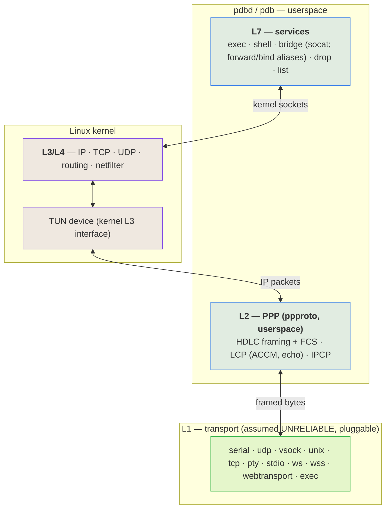
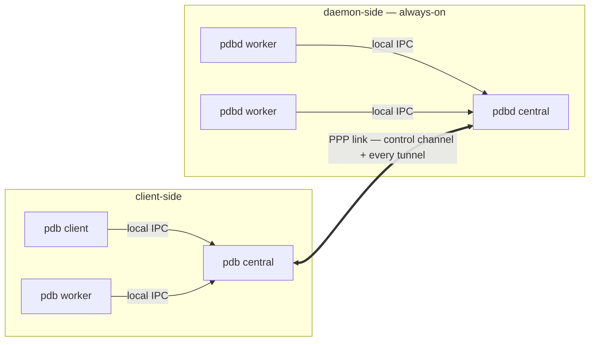
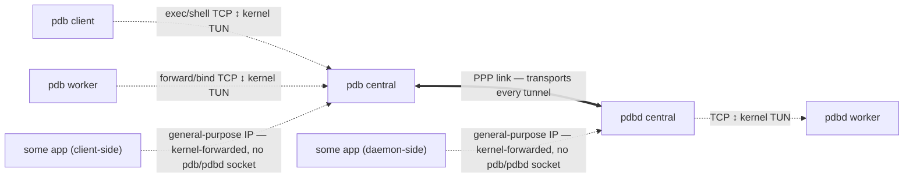
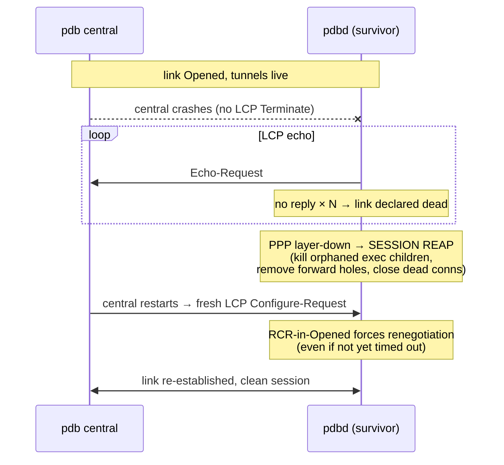

# pdbd

**A transport-agnostic, inject-and-play debug / RPC bridge — one daemon + one client that give you a reliable, multiplexed control channel, remote `execve`, and port-forwarding over *any* byte pipe, even when the pipe isn't reliable.**

> Status: **design / pre-implementation.** This README is the design spec; the wire contract (`pdbd.proto`) is defined and gated, but no implementation exists yet.

---

## Why this exists

Every tool that lets you reach into "the thing on the other side of a channel" is welded to *one* transport and *one* execution model:

| Tool | Transport | Execution |
| --- | --- | --- |
| `ssh` | TCP | shell / PTY |
| `adb` | USB / TCP | shell + `exec-out` |
| `qemu-guest-agent` | virtio-serial | `guest-exec` |
| `docker exec` | unix socket / API | shell / exec |

They solve the *same* problem — *run a process on the far side of a byte channel, forward some ports, maybe get an interactive shell* — four times, four ways, none of them interchangeable. And most of them are **shellful**, which is exactly why `ansible` and `terraform` fight their targets: a shell is not an RPC endpoint (quoting hell, `rc`/profile side-effects corrupting output, needs an interpreter on the target, no clean stdout/exit separation), and neither tool can reach a **console-only / serial** target at all.

`pdbd` collapses that into **one binary over "everything is a socket"**:

- **Any transport.** Serial, UDP, `vsock`, unix socket, TCP, a PTY, stdio, a websocket, or *any program's stdio* — selected with a [socat](https://www.redhat.com/en/blog/getting-started-socat)-style address.
- **Reliable even when the transport isn't.** The transport is assumed hostile and lossy *by construction* — a transport may be a noisy physical UART, a Serial-over-LAN link, or any channel that drops bytes, and "it happens to be a reliable `vsock` today" is never an assumption we're allowed to make. `pdbd` runs **PPP in userspace** to turn any dumb pipe into a real IP link, and lets the **kernel's TCP** carry reliability on top.
- **`execve`, not shell.** Structured `execve(argv[])` with stdio tunneled and a real exit code; a PTY *only* when you ask for `shell`. This is what makes it safe for automation and able to drive serial/console-only hosts the big tools can't.

`pdbd` is **transport- and OS-agnostic by design, meant to be reused across projects** — it is not built for any single one. The general job is **instrumenting and driving Linux images** — a VM guest, a container, or a bare-metal host — over whatever channel reaches them, including the awkward ones (a raw serial console, a Serial-over-LAN link) that `ssh`/`adb`/`docker exec` can't touch. The arc is a single bridge that unifies local-admin `ssh`, `adb`, guest agents, and `docker exec` — optimized for infrastructure use, over anything that looks like a socket.

---

## The layer model

The central idea: **`pdbd`/`pdb` own L1 (transport) and L2 (link), the kernel owns L3/L4 (IP/TCP/UDP), and `pdbd`/`pdb` own L7 (the services).** PPP in userspace bridges a dumb L1 pipe up to a kernel IP interface, so everything above L2 is *real kernel networking* — real sockets, real kernel TCP reliability, real `netfilter`.



### L1 — the transport (assumed unreliable, pluggable)

A dumb, bidirectional byte pipe. **We always treat it as lossy** — a transport may be a noisy physical UART or a Serial-over-LAN link that drops bytes, and a factually-reliable transport (a `vsock`, a unix socket) is never *assumed* reliable. The transport sits strictly *below* the tool.

Transports are named with a **socat / [websocat](https://docs.rs/websocat)-style address** whose `TYPE` encodes both the backend and the direction (connect vs listen), so no separate flags are needed:

```
--socket FILE:/dev/ttyS0,b115200,raw      # a physical UART / Serial-over-LAN device
--socket UNIX-CONNECT:/run/vm/guest.sock  # a VM host-end chardev socket
--socket VSOCK-CONNECT:3:9000             # vsock (cid:port)
--socket UDP-CONNECT:host:9000            # a lossy datagram pipe (the archetype L1)
--socket WS-LISTEN:0.0.0.0:8080           # websocket (insecure)
--socket WSS-CONNECT:host:443             # websocket-secure (TLS) — see Crypto
--socket WEBTRANSPORT-CONNECT:host:443    # WebTransport (secure, over QUIC/UDP) — see Crypto
--socket EXEC:'ssh jump nc target 23'     # ride the link over ANY program's stdio
--socket STDIO                            # ride stdio
```

Each `TYPE` maps to an existing `AsyncRead + AsyncWrite` backend (`tokio` TCP/unix/UDP, `tokio-serial`, `tokio-vsock`, `tokio-tungstenite`+`ws_stream_tungstenite` for `ws`/`wss`, `wtransport` for `webtransport`), so L1 is largely assembly. `pdbd` implements this socat-style address dialect **natively** — the inject-and-play goal is **one** binary on the target, never `pdbd` *plus* a `socat` binary. `EXEC:` is the sleeper feature — the link can ride over anything that produces a pipe — but it runs *whatever program is already there*; it is never a dependency on `socat` being present. **`WSS` and `WEBTRANSPORT` are the built-in *secure* transports** (see *Crypto*): a substrate explosion, though possible, is *unreasonable* for them — their web overhead only pays off with routers between the ends — so their substrate stays stable. The lower-overhead secured pipes (TLS, SSH, raw QUIC) are what exploded traffic actually favors, so they compose *externally* via `EXEC:`.

### L2 — PPP, in userspace

[`ppproto`](https://docs.rs/ppproto)-style **sans-IO PPP** runs HDLC framing (+FCS), LCP, and IPCP entirely in userspace. This is the part that makes a *lossy* serial usable:

- **Self-synchronizing, error-detecting framing** (HDLC flags + byte-stuffing + FCS) — after a corrupted byte it resyncs on the next flag and drops the bad frame, where a length-prefix framing would desync permanently.
- **LCP ACCM** — escapes control bytes a terminal/SOL link would otherwise eat.
- **LCP echo** — detects a dead/half-open peer, keeps an idle link alive, and triggers recovery (see *lifecycle*).

The negotiated IP packets terminate into a **kernel TUN device** — so PPP is done in userspace, but *IP and everything above it is the kernel's*. This backend needs only `CONFIG_TUN` (not kernel PPP), which maximizes portability. A **kernel-PPP backend** (`/dev/ppp`, kernel-side framing) is a future drop-in for performance: it relocates L2 into the kernel without changing L3/L4, so nothing above it moves.

### L3 / L4 — the kernel

Because L2 terminates into a TUN, the kernel runs its full stack on the link: real sockets, routing, `netfilter`, and — crucially — **kernel TCP carries reliability over the lossy pipe.** A frame corrupted on the wire fails FCS and is dropped; the TCP segment it carried is never ACKed; kernel TCP retransmits it. This is how TCP-over-PPP survived noisy modem lines for decades. One system (kernel TCP) gives us reliability, ordering, flow control, fair-sharing across tunnels, *and* the connection-teardown signal our cleanup rides on.

**Address discovery is free:** IPCP conveys each end's address to the other as part of link bring-up (and supports dynamic assignment — the dial-up heritage). So a client learns the daemon's control address from its *own* completed IPCP, regardless of whether that address was user-assigned or kernel-negotiated. No out-of-band discovery.

Because L2 is PPP terminating into a kernel IP interface, the link is itself a **general-purpose PPP network** — it provides ordinary L3 (IP) traffic over non-conventional L1 transports, so `pdbd`'s debug tunnels are just *one* consumer of it and arbitrary IP traffic can ride the same link. **Multi-IP, policy-routing, and firewall zones** then fall out of the kernel L3 interface for free (`ip addr add`, `ip route`, `nft`). These are *latent* — not built in v0, but the architecture leaves the door open to carve the single link into firewalled policy zones (control, forward, and the general-purpose network) later.

### L7 — the services

`pdbd` is, above the link, an RPC/debug agent. Commands: `exec`, `shell`, the **bridge** (`socat`, with `forward`/`bind` as aliases within it), `drop`, `list`.

- **`exec` vs `shell`.** `exec` is a structured `execve(argv[])` with stdio tunneled and a real exit code — *no shell, no PTY* (the automation-friendly primitive, like `adb exec-out`). `shell` allocates a PTY (`adb shell` / `ssh -t`). Each invocation is a *fresh, isolated process*, which is what eliminates the dirty-state problem a single shared console would have.
- **Control plane vs data plane — different multiplexers.** The **control channel** carries lightweight RPCs (start / drop / list / events); its concurrent logical streams are multiplexed by the **RPC framework itself** (see *Control plane*), never hand-rolled. The **data plane** frames by ssh/socat convention, split by command: an **`exec`/`shell`** stream is *serialized* — its stdio (or PTY master) is one framed stream on its **own** kernel TCP tunnel, with nothing to mux; a **bridge** (`forward`/`socat`) is the single exception — it muxes **all** its flows, TCP *and* UDP, over **one** reliable TCP tunnel (`(flow-id, proto, window)` per frame), ssh-channel style (see *Why the data plane needs no muxer*). Per-connection kernel tunnels keep unrelated commands off a shared connection (no HTTP/2-style cross-stream head-of-line coupling on a lossy link); the bridge accepts an in-tunnel mux only because UDP must ride a reliable tunnel and one forward is one logical bridge.

### Process model

The two ends have **different** process constraints:

- **`pdb` (client-side) requires multiprocess.** Each invocation is a distinct OS process, `central` is a separate singleton, and a `forward`/`bind` gets its own spun-up **`pdb worker`** process (the client/worker/central split is detailed under *Topology*); they coordinate over local IPC. The invocation model *forces* this — it cannot collapse to one process.
- **`pdbd` (daemon-side) is multiworker and does not require multiprocess.** Its hard requirement is a **connection owner per tunnel** (something holds the socket fd and drives it) plus **`execve` children**. The `execve` children do run as separate processes (`execve` replaces the image); the *connection owners* need not be — they may be `async` tasks, threads, or processes. Process-per-tunnel is a **choice for crash/exploit isolation** (a faulting tunnel can't corrupt the core — `sshd`-privsep's rationale), not an architectural requirement. An alternative-language `pdbd` may run a single-process worker pool — and if it instead runs a *multiprocess* pool, that core↔worker boundary becomes public wire (see *Control plane*).

Common to both ends: a small, long-lived **control-plane core** owns the link and the control channel, while volatile per-connection work lives in disposable workers (`sshd`'s process-per-connection, `adbd`'s per-stream model). Concurrency within a worker is implementation-defined (the reference impl uses `tokio` async tasks over an event-loop reactor); isolation *between* tunnels is whatever boundary the impl chose. See *Concurrency & flow control* for the cross-language contract.

---

## Topology & lifecycle

Modeled on `ssh`/`adb` — **client-side vs daemon-side**, never "host/guest" (on bare metal there is no host/guest, just two ends of a wire).



The heavy line is the one **PPP link between the two centrals**, and it carries **everything** — the control channel *and* every data tunnel, each a separate kernel-TCP connection the kernel demuxes by 4-tuple. **Ownership and transport are different things.** The **centrals** own the link and *transport* every tunnel (each end's kernel routes tunnel packets out its **TUN**, and the central's `ppproto` pump carries them over the link) — but a central never holds a tunnel's socket. The **connection owners** do: a **`pdb client`** for its `exec`/`shell`, a **`pdb worker`** for a `forward`/`bind`, a **`pdbd worker`** on the daemon end. So a tunnel's bytes *flow through* the centrals' PPP pipe while being *owned* at the edges. `central`/`worker`/`client` are **roles**, never commands you type.

- **`pdbd`** — the daemon. **Always on**, daemon-side, idles waiting for a peer. The permanent endpoint; its **workers** own the daemon end of every tunnel.
- **`pdb`** — the client, in **three roles**:
  - **client** — the per-command invocation you actually run (`pdb exec …`, `pdb forward …`): command-and-control plus `exec`/`shell` stdio, owning its own `exec`/`shell` tunnel. Dies with the command.
  - **worker** — spun up by central to **own a `forward`/`bind`** on the client end, mirroring a `pdbd` worker. Outlives the `client` that asked for it; lives as long as the tunnel.
  - **central** — a **singleton** that owns the PPP link + control channel and **transports** every tunnel over it, so the expensive, fragile link is established *once* and amortized. Holds no tunnel socket itself.

**Orchestration.** You only ever invoke a `pdb` **client**. On start it finds the running **central**, or — if none exists — **auto-spawns one** (exactly as `adb` auto-starts its background server) and attaches. A `forward`/`bind` client asks central to **spin up a `pdb worker`** to own the tunnel, then the client may exit; an `exec`/`shell` client owns its tunnel itself. Every client and worker shares the one central. There is no `pdb central`/`pdb worker` command — both are spawned, discovered, and reaped implicitly.

**IPC & transport.** A `pdb` client/worker ↔ central speak over a **local IPC socket** (UDS) for control. central owns the PPP link + the control channel to `pdbd` and **transports** every tunnel over the link — but it is **not a socket-owning relay**: a tunnel is a kernel-TCP connection whose *endpoints* are owned by the client/worker and the `pdbd` worker, while its *packets* ride central's TUN→PPP pump. So central moves the bytes (as IP over PPP) without ever holding the tunnel's socket or seeing it as an application stream. central is where the link, the control channel, and the tunnel table live; the owners hold the fds. The three control hops and the wire standard they share are detailed under *Control plane*.

**Lifecycle.** central's lifetime is **refcounted to the tunnel table — not to the number of clients.** It exits when the active-tunnel count drops to zero, which brings the link down. A standing `forward`/`bind` is owned by a **`pdb worker`** that outlives the `client` which launched it, so it keeps the tunnel table non-empty and central alive; an `exec`/`shell` tunnel dies with its `client`. (An idle-linger grace before exit is an option, to keep a warm link across bursts of activity.)

### Tunnel ownership

**All** TCP — `pdbd`'s debug tunnels *and* other traffic on the general-purpose PPP network — rides the kernel's TCP/IP over the one PPP link. Two distinct questions, often conflated: **who owns a tunnel's socket**, and **who transports its packets.**



- **Ownership (the edges).** Every debug tunnel is a kernel-TCP connection with a connection owner at each end, each holding the *fd* and doing the I/O: a **`pdb client`** for its `exec`/`shell`, a **`pdb worker`** for a `forward`/`bind`, and a **`pdbd worker`** on the daemon end. The owner **opens its socket from creation** — directed over RPC ("accept/connect tunnel-id *X*"), it does the `accept`/`connect` itself. Nothing passes an fd across a boundary, so every boundary stays portable and language-neutral (a cross-language/cross-host worker can't receive a Unix `SCM_RIGHTS` descriptor). **fd-passing** (`SCM_RIGHTS`) survives only as an **optional same-host optimization**, never part of the wire contract.
- **Transport (the middle).** The **centrals own no tunnel socket** — they move the packets. Each owner's kernel routes its tunnel traffic out the **TUN**; the central's `ppproto` pump carries it over the PPP link to the peer central, whose TUN delivers it to the peer owner. So the centrals *transport* every tunnel (and the control channel) without ever holding a tunnel fd or seeing it as an application stream. Each central also keeps the **tunnel table** (control + refcount) — accounting, not ownership.
- **General-purpose PPP-network** traffic is kernel-forwarded IP with **no `pdb`/`pdbd` socket** at all — it never enters a tunnel table, rides the same PPP link, and shows up only in the *kernel's* view (`ss` / `conntrack`). **Both** ends have a TUN, so the PPP network is symmetric: an app on *either* host — client-side or daemon-side — can put ordinary traffic on the link, not just `pdbd`'s tunnels.

Ownership needs no packet inspection — it's just which process holds the fd; transport needs none either — the kernel routes it to the TUN. The kernel does the TCP for everything regardless.

### Cleanup — reactive first, `drop` as a convenience

We never trust graceful signals (things die without notice). So the **kernel's TCP state is the cleanup oracle**: FIN / RST / keepalive-failure on a tunnel → `pdbd` reactively reaps that command's resources (kill the `exec` child, remove the `forward` hole). A **`drop <tunnel-id>`** command is the *explicit, graceful* teardown of a long-runner — it triggers the same reap path early, but it is **not** the safety net; the kernel is.

### Recovery from non-graceful termination

If `central` vanishes without an LCP Terminate (crash) while the pipe stays up, PPP is built to recover — it's the dial-up heritage:



Two native mechanisms do the heavy lifting: **LCP echo** detects the dead/half-open peer, and a **returning peer's Configure-Request forces renegotiation** even if the survivor hasn't timed out yet (RFC 1661 `RCR`-in-`Opened`). **PPP heals the *link*; `pdbd` heals the *session*** — it hooks PPP's layer-down event to reap orphaned children, firewall holes, and dead connections, so the returning `central` meets a clean daemon.

---

## Control plane — RPC, muxing & interoperability

The data plane is multiplexed by the **kernel** (per-tunnel 4-tuple) and `ppproto` (frames on the pipe) — settled, and no userspace muxer is pulled for it. What genuinely needs multiplexing is the **control plane**, which is **three segments**:

1. **pdb client / pdb worker → pdb central** — local IPC (UDS)
2. **pdb central → pdbd central** — over the PPP link (kernel TCP over the TUN)
3. **pdbd central → pdbd conn-worker** — local IPC (UDS), *present only when the daemon runs a multiprocess worker pool*

Each carries many small concurrent logical streams (start-exec, tunnel-opened, exit-status, list, drop, keepalive). None of it is hand-rolled: the multiplexer is the **RPC framework's own**.

### The interop requirement — a universal wire, not a Rust API

`pdbd`/`pdb` are a *reference* implementation. The wire must be a **standardized, language-neutral protocol with a published schema**, so independent reimplementations — `gopdbd`/`gopdb`, `jpdbd`/`jpdb`, `cpdbd`/`cpdb` — are **plug-and-play with each other and with this one**. A `cpdb` ephemeral controlling a `gopdb` central talking to a `jpdbd` central driving a Rust `pdbd` conn-worker must *just work*. That rules out any language-private RPC (e.g. a Rust-serde framing): the contract is the wire, and the wire is a standard.

This makes **segment 3 a public interface, conditionally**: a daemon that runs a multiprocess worker pool **must** speak the standard across it (so a `jpdbd` central and a Rust conn-worker interoperate); a single-process daemon has no such wire and legitimately opts out. The clean guarantee is **one standard service, with central and pdbd-central as routers that forward it** — then the worker boundary speaks the identical service for free.

### The choice

Two protocols satisfy "international standard + built-in mux + first-party implementations in every target language":

| Protocol | Wire | Mux | Multi-language |
| --- | --- | --- | --- |
| **gRPC** *(recommended)* | HTTP/2 + protobuf (CNCF) | **HTTP/2 streams — RFC 9113** | grpc-go, grpc-java, grpc C/C++ core, Python, C#, … — first-party; interop is its whole purpose |
| **Cap'n Proto RPC** *(alternative)* | Cap'n Proto wire + `rpc.capnp` | question/answer-id mux + promise pipelining (in-spec) | C++, Rust, Go, Java, Python |

**gRPC is the recommendation** — cross-language interop is the solved, boring case, and its mux (HTTP/2) is itself an IETF RFC. Cap'n Proto is the credible alternative (promise pipelining cuts round-trips on a high-latency serial link, and it is lighter than HTTP/2), with thinner multi-language RPC-layer maturity. A Rust-only RPC (`tarpc` et al.) is **disqualified** by the interop requirement, whatever its ergonomics.

> This is why gRPC/`tonic` is *not* in the rejected pile for the control plane. The HTTP/2 head-of-line concern applies only to carrying **tunnel bulk** — many high-throughput streams on one connection — which is exactly what the per-tunnel kernel-TCP design keeps *off* the RPC. Tiny control messages lose nothing to HTTP/2.

### The contract is a versioned schema

The artifact that makes cross-language real is a **published, versioned `pdbd.proto`** (or `.capnp`): one `ControlService` every implementation codegens from — a **published interface contract consumers depend on at a version**, not a transient file. The package is the major version (`pdbd.v1`); within it the schema evolves only compatibly (append fields, never renumber or repurpose), which `buf breaking` enforces in CI.

**The surface.** Seven RPCs on `ControlService`:

- **`Hello`** — the capability/version handshake a peer runs first. It exchanges an `implementation` id (`"pdbd"`, `"gopdb"`, …), a `wire_version` (the `pdbd.v1` revision the peer speaks), and optional `features` tokens (`"pty"`, `"socat"`, `"bind"`, …), so a mixed-implementation link degrades knowably instead of guessing.
- **`Exec`** / **`Shell`** — start a command; each returns a **stream of command events**. `Exec` is a structured `execve`: `argv[0]` is the program (no shell, no word-splitting), with `env` pairs, a `cwd`, and `clear_env` to start from an empty environment instead of inheriting. `Shell` is the same but allocates a PTY — an empty `argv` runs the target's login shell — and its request carries an initial PTY window size.
- **`Resize`** — change a running shell's PTY window size (the SIGWINCH path), keyed by the shell's tunnel id.
- **`Socat`** — the **one bridge**; `forward`/`bind` are aliases *within* it, not separate RPCs. It bridges two endpoints across the link and returns a tunnel **id** for `Drop`. Each endpoint is `<side>:<addr>` where `<side>` ∈ `client | daemon` and `<addr>` is any socat-style address — or the alias **`bind`** (= listen) / **`forward`** (= connect):
  - **port-forward** (the common case): `pdb client:bind:<ip>:<port> daemon:forward:<ip>:<port>` (swap the sides for reverse; either order). The alias carries **no proto** — it forwards **both TCP and UDP**; for a single protocol, drop to a raw `TCP-LISTEN:` / `UDP-LISTEN:` address. `bind` and `forward` come as a **pair** — a bridge has exactly two ends, one ingress + one egress, never two of a kind.
  - **general bridge**: `pdb client:TCP-LISTEN:… daemon:EXEC:'…'` — any socat address types, for the cases a TCP port-forward can't express.
  - **One tunnel; muxed on demand.** A bridge rides **one reliable TCP tunnel** owned by a sole **pdb/pdbd worker pair** — ssh's architecture (the worker's internal model is implementation-defined, the shared backpressure contract is not — see *Concurrency & flow control*). A raw `LISTEN` bridges **one connection by default**; append **`,mux`** — pdbd-native, with **`,fork`** as its socat-adoption alias — to **multiplex many connections over the one tunnel** (emulated in the event loop, never a process fork; a socat `max-children` becomes a mux cap). The `bind`/`forward` aliases are always muxed and carry both protocols, so a single port-forward multiplexes all its TCP and UDP flows over that one tunnel. Raw *lossy* UDP, if ever wanted, crosses natively over the general-purpose PPP network instead.
- **`Drop`** / **`List`** — tear down one tunnel by id; snapshot the active tunnel table.

**The event protocol.** The streaming RPCs carry a *lifecycle*, not bulk (bulk rides the tunnel):

- a **command stream** (`Exec`/`Shell`) emits `opened` **first** — connect that command's stdio/PTY tunnel — then exactly **one terminal** event: `exited` (an exit `code`, meaningful when the terminating `signal` is `0`) or `error`.
- the **bridge** (`Socat`) does **not** stream — it returns its tunnel **id** once, and the many TCP/UDP flows it muxes over that one tunnel surface in `List`, not as events.

The `pdbd.v1` module is split by concern across `service` / `command` / `socat` / `tunnel` / `common` `.proto` files (all one package); the files carry no prose — all of the above is their documentation.

### Two standardized layers, stacked

The "control channel" is really two already-international standards on top of each other:

1. **PPP link control** — LCP/IPCP (`ppproto`), **RFC 1661 / 1332**: establishes the link, negotiates addresses, carries liveness.
2. **Application RPC** — gRPC + `pdbd.proto`, over kernel TCP, which exists only *after* IPCP brings up IP (so the RPC always rides a reliable stream).

The stack is therefore standard wire top to bottom: RFC-1661 PPP → kernel IP/TCP → RFC-9113 HTTP/2 → protobuf. A reimplementer has a spec for every layer.

### Why the data plane needs no muxer at all

A userspace mux (yamux, SSH channels, HTTP/2, adb's multiplexing loop) exists to run many logical streams over **one** connection *when the transport has no IP layer*. `pdbd` gives itself an IP layer (PPP → TUN → kernel), so most tunnels are just another kernel socket, demuxed by 4-tuple. The only scenario a general data-plane mux would help is **TCP-tuple exhaustion** — and that is moot: on a point-to-point IPv4 link to one control endpoint only the source port varies (~64 k), but allocating **IPv6** (or binding multiple source addresses — which multi-IP-over-PPP already allows — and/or a `pdbd` holding multiple addresses) makes the tuple space astronomically larger than any host's fd / memory / scheduler budget. You exhaust **physical compute** long before the tuple pool, so a general mux buys nothing the kernel does not already give.

**The one exception — the bridge (`Socat`/forward) tunnel.** A bridge multiplexes **when it carries more than one flow**, by necessity: the `bind`/`forward` aliases forward **both** TCP and UDP, and a `,mux`/`,fork` LISTEN accepts many connections — all riding **one reliable TCP tunnel** over the lossy link (forwarded UDP especially must, since raw UDP would just drop). So such a bridge is **one TCP tunnel owned by a sole pdb/pdbd worker pair that frames and muxes its flows** (`(flow-id, proto, window)` per frame) — ssh's one-process-many-channels model, confined to this one tunnel. A plain single-connection, single-protocol `LISTEN` carries one flow and needs no frame — a bare stream. Everything else stays unmuxed (control plane = the RPC lib's mux; `exec`/`shell` = one kernel socket each; general PPP traffic = kernel 4-tuple). This still doesn't pull `yamux`: that frame must carry **datagrams** (UDP), which yamux (stream-only) can't, so it's a small bespoke frame, not a library mux.

### Concurrency & flow control

Independent implementations (`gopdb`, `jpdb`, a Rust `pdbd`) must interoperate over the same TCP pipes and IPC, yet their *internal* concurrency models don't reconcile — Rust/C# are stackless `async`/await, Go / Java-21+ (Loom) / Erlang are stackful green/virtual threads, C is callbacks. So the concurrency **model is implementation-defined**; what is standardized is the **flow-control contract on the shared boundaries**.

- **The universal substrate is the event loop** — a readiness reactor (epoll / kqueue / IOCP). Every target language has one under the hood (libuv, Netty, Go's netpoller, tokio's reactor), and layers its idiomatic concurrency on top. The **reference Rust `pdbd` uses `tokio`** (async tasks over the reactor), with the optional process-per-worker boundary for isolation. `io_uring` is a Linux-only completion-based optimization an impl *may* add; the readiness reactor is the portable floor.
- **The cross-language contract is per-flow windowed flow control** — the convergent design of every mux protocol (SSH channels, RFC 4254; HTTP/2 `WINDOW_UPDATE`, RFC 9113; yamux; smux): a receiver advertises credit, a sender may not exceed it, window-update frames replenish it. It's a *wire* protocol, so it ports regardless of internal concurrency, and it's what propagates backpressure and stops one flow starving others inside a mux.
- **Where pdbd needs it:**
  - **control plane + IPC** inherit it for free — gRPC's HTTP/2 gives per-stream + per-connection `WINDOW_UPDATE` across all three segments.
  - **the bridge tunnel** is the one place pdbd authors it — its `(flow-id, proto, window)` frame carries a **per-flow credit**, same pattern, so a mixed-language bridge agrees on backpressure without agreeing on threads.
  - **`exec`/`shell`** need none — a serialized single stream per kernel-TCP tunnel; kernel TCP *is* the flow control.
- **The behavior spec stays event-loop-expressible** — readiness, explicit window credits, explicit close *frames* — never Rust-`async`-specific constructs (Future-drop cancellation, `select!`), so Go / Java / C can match it. The clinching precedent is ssh itself: OpenSSH (C, select loop), `russh` (Rust/tokio), Go's `x/crypto/ssh` (goroutines), Apache MINA (Java) all interoperate because the channel **window protocol** is uniform while each uses its native concurrency.

---

## The `pdb` / `pdbd` CLI

The *Control plane* above is the RPC surface; this is how a human drives it. The daemon binds a transport and waits; the client runs one command over the link.

```
# daemon — bind an L1 transport, idle until a peer attaches
pdbd --socket <L1>

# client — run a command. --socket/--ip/--port apply only to the invocation
#          that establishes or attaches the link; a running central already
#          holds it, so later commands omit them.
pdb [--socket <L1>] [--ip <ppp-ip>] [--port <n>] <command>
```

**Link flags** (link-establishing invocation only):
- `--socket <L1>` — the L1 transport, a socat-style address: `FILE:/dev/ttyS0,b115200,raw`, `TCP:host:port`, `VSOCK-CONNECT:cid:port`, `WSS-CONNECT:host:443`, `EXEC:'ssh host …'`, `STDIO`, …
- `--ip <ppp-ip>` / `--port <n>` — the control-channel address on the PPP link; optional, IPCP-negotiated when omitted.

**Commands:**

```
pdb exec  [--cwd DIR] [--env K=V]… [--clear-env] -- argv…      # structured execve; stdio tunneled, real exit code
pdb shell [--cwd DIR] [--env K=V]… [--clear-env] [-- argv…]    # PTY; empty argv ⇒ login shell
pdb <side>:<endpoint>  <side>:<endpoint>                       # the bridge (forward / socat) → prints a tunnel id
pdb drop <id>                                                  # tear a tunnel down
pdb list                                                       # show the tunnel table
```

- **`exec` / `shell`** are verbs because they carry argv — everything after `--` is the remote command verbatim (no shell on `exec`; a PTY only on `shell`).
- **the bridge** is two `<side>:<endpoint>` args, `<side>` ∈ `client | daemon`, `<endpoint>` either an alias or a raw socat address:
  - **alias** — `bind:<ip>:<port>` (listen) or `forward:<ip>:<port>` (connect). No proto: an alias forwards **both TCP and UDP**, and is always muxed. Exactly one `bind` + one `forward` — a bridge has two ends — in either order:

    ```
    pdb client:bind:0.0.0.0:5432  daemon:forward:10.0.0.5:5432   # local-forward, TCP+UDP both (swap sides for reverse)
    pdb daemon:bind:0.0.0.0:8080  client:forward:127.0.0.1:3000  # reverse — just swap the sides
    ```

  - **raw socat** — any address type, for what a port-forward can't express; a LISTEN bridges **one connection by default**, `,mux` (pdbd-native) or socat's `,fork` to multiplex:

    ```
    pdb client:TCP-LISTEN:8080      daemon:EXEC:'/usr/local/bin/sensor'  # one connection, bridged, done
    pdb client:TCP-LISTEN:8080,mux  daemon:TCP:10.0.0.5:80               # ,mux (≡ socat ,fork): many conns, one tunnel
    ```

- **`drop` / `list`** are verbs over the tunnel table; `<id>` is what the bridge printed.

**Parsing rule.** The first non-flag token is either a bare **verb** (`exec`/`shell`/`drop`/`list`) or a **`<side>:…` bridge endpoint** (it begins `client:` or `daemon:`). The leading `client:`/`daemon:` is unambiguous, so verbs and bridge args never collide — forwarding needs no verb of its own.

---

## Bootstrap & the control channel

- `pdbd` is already running. `pdb central` comes up, brings up the PPP link, and **learns `pdbd`'s control address from its own IPCP** — no fixed address required, no out-of-band discovery.
- The control service binds the **IPCP-primary address** so it's the one IPCP conveys. Port is a configurable default (overridable), with a tiny announce/discovery exchange as the dynamic-port fallback. "Fixed" is a *default*, never an *assumption*.
- `pdbd` **programs its own firewall hole** for the control port (it holds `CAP_NET_ADMIN`), so it doesn't fight the firewall — it configures it. Everything after the control channel (forwards, exec) is negotiated *over* the control channel and provisioned on demand.

---

## Crypto

`pdbd` grows **no general-purpose crypto layer**. Its stance is *approximately* **socat's** — select a secured transport, pass its options through, hold no security *policy* — with one deliberate departure: socat exposes **OpenSSL as a generic wrap** over any address, and `pdbd` has no such generic TLS wrap. The TLS it *does* ship is **bound inside the built-in `WSS`/`WEBTRANSPORT` transports** (rustls, feature-gated); wrapping an *arbitrary* L1 in TLS is composed externally (below). (The earlier "we're a trusted-channel debug daemon, so skip crypto" premise fell away once plug-and-play pulled in serious **general-administration / IaC** use, where a secured hop is a normal requirement — so carrying security is in scope; *owning* it is not.)

So the only question is **which secured transports are built in vs composed externally**, and it reduces to **one criterion**:

> **Build in a secure transport iff an L3-and-below "substrate explosion," though technically possible, would be *unreasonable* for it — so its substrate stays stable in practice. The lower-overhead protocols an explosion actually favors stay external.**

The test is **L3-and-below**, not L4 — everyone can assume TLS→TCP and QUIC→UDP; the question is what sits *under* that. And it is **economic, not categorical**: an exploded substrate is *possible* for all four (TLS, QUIC, WSS, WT), but only *reasonable* for some.

- **WSS / WebTransport → built in.** You *could* run WSS over an exotic L1 — it isn't forbidden — but it would be an unreasonable stack. WSS is built for **conventional routed web traffic**: HTTP upgrade + framing + masking, *plus* TLS — and that overhead only earns its keep when routers and firewalls sit between the ends. Strip that context (a point-to-point serial line, a vsock) and the web machinery buys nothing: raw OpenSSL gives the *same* TLS with **less** overhead, raw QUIC likewise. So nobody off the conventional web reaches for WSS/WT — even the odd low-latency case (Chrome driving CDP over WebSocket) stays on routed OSI TCP. The substrate doesn't explode because **the protocol stops making sense the moment it would**, which is what makes it safe to assume.
- **TLS and QUIC → external.** They are substrate-flexible *and* they are exactly what an explosion favors — lower overhead, no router assumption. TLS is *already* exercised polymorphically (over TCP, unix, vsock, serial, tunnels); QUIC isn't dominated by exotic substrates today, but nothing stops it following TLS — and when traffic *does* leave the routed web, raw TLS / raw QUIC streams are precisely where it lands. So there is no stable substrate to assume; both stay external — which is also a *feature*: it encourages users to compose their own secured L1 (SSH, openssl-over-serial/vsock, plain TLS-over-TCP, a QUIC tunnel) rather than privileging one.

**WebTransport is included for the same reason as WSS.** It carries the same web-oriented overhead, so an exploded-substrate deployment would drop it for raw QUIC exactly as it drops WSS for raw TLS — its substrate stays stable by the same economics. Raw QUIC has no such overhead to shed, so it is where an explosion lands: external, not built in.

Secure transports are **feature-gated** — `serial`/`udp`/`unix`/`tcp`/`stdio`/`exec` are always in; `wss`/`webtransport` are opt-in `cargo` features, so the lean trusted-channel core never has to carry a TLS/QUIC dependency tree.

### Built-in — Websocket-secure (`WSS`)

Primary secure transport. TLS + cert verification come from the WS stack (`tokio-tungstenite` + `rustls`); pdbd just selects it as an L1:

```bash
pdbd --socket WSS-LISTEN:0.0.0.0:443,cert=server.pem,key=server.key
pdb  --socket WSS-CONNECT:gateway.example:443  exec -- uname -a
```

(PPP/kernel-TCP over a TCP-based WSS is TCP-in-TCP — the standard caveat for any TCP-based L1; see *L1*.)

### Built-in — WebTransport (`WEBTRANSPORT`)

The secure transport for a QUIC-capable network (needs UDP reachability; `wtransport` on `quinn`). A **datagram** session is the default exposure — encrypted, NAT-traversing UDP, the lossy pipe pdbd is built for, with no reliability doubled under kernel TCP:

```bash
pdbd --socket WEBTRANSPORT-LISTEN:0.0.0.0:443,cert=server.pem,key=server.key
pdb  --socket WEBTRANSPORT-CONNECT:gateway.example:443  exec -- uname -a
```

### External — compose your own secured L1

Everything else secures *outside* the binary, handed to pdbd through the `EXEC:` escape hatch (or a forwarded local port) — pdbd carries no TLS/SSH/QUIC code. This runs **where those tools already exist** — typically the **client** side; it is *not* assumed on the injected daemon (single-inject means the target carries only `pdbd`). A daemon-side `pdbd --socket EXEC:'socat …'` below therefore presumes that host happens to have `socat`/`openssl`; where it doesn't, the daemon's secure options are the built-in `WSS`/`WEBTRANSPORT` or a trusted channel. Three ready tools:

**OpenSSL** — a plain TLS pipe via `socat` or the `openssl` binary:

```bash
# socat OPENSSL
pdbd --socket EXEC:'socat - OPENSSL-LISTEN:4433,reuseaddr,cert=server.pem,key=server.key,verify=1'
pdb  --socket EXEC:'socat - OPENSSL:gateway.example:4433,verify=1'  exec -- uname -a
# openssl s_server / s_client
pdbd --socket EXEC:'openssl s_server -quiet -accept 4433 -cert server.pem -key server.key'
pdb  --socket EXEC:'openssl s_client -quiet -connect gateway.example:4433'  exec -- uname -a
```

**SSH** — stdio, port-forward, reverse-forward, or SOCKS5:

```bash
# stdio (ssh -W is the clean form; or exec pdbd on the far side)
pdb  --socket EXEC:'ssh -W dbhost:4000 jump'           exec -- uname -a
pdb  --socket EXEC:'ssh host pdbd --stdio'             exec -- uname -a
# local forward (-L): forward a port, then ride plain TCP to it
ssh -fN -L 7000:dbhost:4000 jump
pdb  --socket TCP:127.0.0.1:7000                       exec -- uname -a
# reverse forward (-R): run on the daemon host; pdb then dials 127.0.0.1:7000 client-side
ssh -fN -R 7000:localhost:4000 client-host
# SOCKS5 (-D): proxy, then a SOCKS5-capable dial
ssh -fN -D 1080 jump
pdb  --socket EXEC:'ncat --proxy 127.0.0.1:1080 --proxy-type socks5 dbhost 4000'  exec -- uname -a
```

**QUIC** — a raw QUIC pipe via [`quicat`](https://github.com/pas2k/quicat), the socat-shaped QUIC utility (stdio both ends, so it reads like the `ssh -W` / `openssl s_client` cases):

```bash
pdbd --socket EXEC:'quicat quic-passive-listen://0.0.0.0:4433 stdio'
pdb  --socket EXEC:'quicat stdio quic-active-connect://gateway.example:4433'  exec -- uname -a
```

> `quicat` is **experimental** (single QUIC session at a time, lightly maintained) — shown as the clean *pattern* (QUIC stream → stdio → pdbd), not a production pick. Note `openssl s_client -quic` is **not** a substitute: OpenSSL's QUIC is HTTP/3-oriented (ALPN-mandated), not a raw byte pipe. For real traffic prefer a maintained QUIC tunnel (e.g. `ombrac`, TCP/UDP-over-QUIC) exposing a local port pdbd rides.

### Baseline — insecure, over a trusted channel

On a trusted point-to-point pipe (local serial, `vsock`, unix socket) crypto is pure overhead and is simply omitted — the canonical `pdbd` deployment:

```bash
pdbd --socket FILE:/dev/ttyS0,b115200,raw
pdb  --socket FILE:/dev/ttyUSB0,b115200,raw  exec -- uname -a
```

So: `pdbd` secures a WAN hop with built-in **WSS / WebTransport**, secures an arbitrary pipe with **external OpenSSL / SSH / QUIC via `EXEC:`**, and runs **bare on a trusted channel** — never growing a general-purpose crypto layer.

---

## Prior art

No single tool does what `pdbd` does — **transport-agnostic remote exec *and* a general IP path over the same arbitrary byte pipe** — but each half is well-trodden. Surveyed across languages (not just the C/Rust systems world) so we steal the right grammar rather than reinvent it.

**PPP, in userspace** — the L2 we need:

- [`ppproto`](https://docs.rs/ppproto) (Rust) — `no-std`, no-alloc, sans-IO PPP implementing RFC 1661 (LCP) + RFC 1332 (IPCP), tested against `pppd`. **Our starting point for L2** — sans-IO is exactly the shape that lets us feed it any transport.
- [Fuchsia PPP](https://fuchsia.googlesource.com/fuchsia/+/refs/heads/main/src/connectivity/ppp) (Rust) — PPP over serial with LCP/IPCP/IPv6CP; a fuller reference implementation.
- [`zouppp`](https://github.com/hujun-open/zouppp) (Go) — userspace PPP/PPPoE client with its own LCP/IPCP/IPv6CP state machines; the cleanest cross-language cross-check for our control-protocol logic.
- [`pppd`](https://github.com/ppp-project/ppp) (C) — the canonical reference for driving *kernel* PPP (GPLv2; we reimplement the grammar/behavior, never vendor the code, so `pdbd` stays permissively licensed).

**Userspace IP — the road not taken.** We terminate IP in the *kernel* via a TUN device (real sockets, kernel TCP reliability). The alternative — a userspace TCP/IP stack — is proven but heavier: [gVisor `netstack`](https://github.com/google/gvisor) (Go) and [`smoltcp`](https://docs.rs/smoltcp) (Rust). Recorded as the explicit fork in the design, not an oversight.

**Transport-agnostic remote exec / RPC** — the L7 we need:

- [`u-root`'s `cpu`](https://github.com/u-root/cpu) (Go) — plan9-`cpu`-inspired remote exec that carries namespaces over a flexible transport; **closest in spirit** to the exec half.
- [`gokrazy/breakglass`](https://github.com/gokrazy/breakglass) (Go) — inject a static binary into an otherwise-immutable appliance and get an interactive debug shell; the "break glass into a sealed image" use-case, which is exactly ours.
- [`eRPC` / EmbeddedRPC](https://github.com/EmbeddedRPC/erpc) (C/C++) — RPC explicitly decoupled from transport (serial, TCP, USB, RPMsg); the strongest prior art for *one RPC surface over many byte pipes*.
- [`citizenshell`](https://github.com/meuter/citizenshell) (Python) — one shell API over telnet / ssh / serial / adb; the clearest statement of the **unification** goal `pdbd` chases, from the scripting world.
- [Apache MINA SSHD](https://github.com/apache/mina-sshd) (Java) — a full SSH client+server *library* (not a CLI); the reference for SSH-as-embeddable-protocol rather than a daemon.

**L1 address grammar:**

- [`websocat`](https://docs.rs/websocat) / `socat` — socat-style address specifiers; the dialect reference for `pdbd`'s `--socket` L1 addresses (grammar *reimplemented*, never copied from GPL `socat`).

**Control-plane wire & mux standards** — what the interop requirement draws on:

- **gRPC** (HTTP/2 + protobuf, CNCF) / **Cap'n Proto RPC** — the two language-neutral RPC standards with built-in stream multiplexing and first-party implementations across Go/Java/C++/Python/C#/Rust; the interop contract (see *Control plane*).
- **HTTP/2 — RFC 9113** / **QUIC** ([`quinn`](https://docs.rs/quinn)) — the mux + connection-migration reference designs. QUIC-as-the-core-transport was weighed and set aside: it bundles mux + reliability + crypto that `pdbd` already gets from the kernel + PPP, and (like TLS) it is substrate-flexible, so it stays an **external** secured L1 (a QUIC tunnel / `quicat` via `EXEC:`), never a built-in. Its migration design is still the comparison point for our PPP recovery (below). WebTransport — QUIC wearing an OSI-bound web architecture — *is* built in; raw QUIC is not (see *Crypto*).
- [`yamux`](https://docs.rs/yamux) (libp2p) — a mature userspace stream multiplexer; the thing we **don't** pull, because the kernel IP layer makes it unnecessary.

**Multiplexing daemon & privilege separation** — the process-model prior art:

- **`adb`** — one binary is client *and* server, binds `localhost:5037`, **auto-starts the server if absent**, refcounts, and is "one giant multiplexing loop." The direct model for `pdb central`'s singleton / auto-spawn / refcount lifecycle.
- **OpenSSH privilege separation** — a privileged monitor + unprivileged, disposable per-connection children with a narrow op-set across the boundary; the model for the core-vs-worker split.

**Roaming / recovery from a dead peer:**

- **Mosh / SSP** — stateless UDP roaming (highest-seq authentic packet re-targets the peer; ≤3 s heartbeat; survives IP/NAT change). The comparison point for our LCP-echo + RCR-in-Opened recovery — Mosh does it at L4 with sequence numbers; we do it at L2 with PPP while kernel TCP tunnels ride on top.
- **QUIC connection migration** — connection-IDs route across a changed 5-tuple; the same recovery goal solved at the transport layer (and UDP-bound, as above).

**Port-forward / tunnel fleet** — the `forward`/`bind` prior art:

- [`russh`](https://docs.rs/russh) (Rust) — exposes `direct-tcpip`/`forward-tcpip` + unix-socket forwarding; the embeddable-SSH reference for the forwarding primitives.
- **rathole** (Rust, 14 k★), **bore** (Rust, 11 k★), **chisel** (Go, 17 k★, tunnel-over-HTTP), **frp** (Go, 110 k★) — the NAT-traversal tunnel fleet; prior art for port-forward UX and reverse tunnels (none transport-agnostic the way `pdbd` aims to be).

**The tools this unifies:** `adb`, `ssh`, `qemu-guest-agent`, `docker exec` — each solves one transport or one capability; `pdbd` is the single endpoint that spans them.

---

## Libraries

Candidate Rust dependencies, by layer — versions verified against crates.io on 2026-10-04.

**L2 — PPP:**

- [`ppproto`](https://crates.io/crates/ppproto) `0.2.1` — sans-IO PPP state machine (LCP + IPCP). Primary L2 engine. HDLC framing + FCS are internal to it; a standalone [`hdlc`](https://crates.io/crates/hdlc) `0.4.1` is the fallback only if we drive framing ourselves.

**L3 — TUN device:**

- [`tun-rs`](https://crates.io/crates/tun-rs) `2.8.11` — cross-platform TUN/TAP, async-capable; broadest device support. Preferred.
- [`tun`](https://crates.io/crates/tun) `0.8.14` / [`tokio-tun`](https://crates.io/crates/tokio-tun) `0.15.2` — leaner Linux-first alternatives if we don't need the portability surface.

**L1 — transports (pluggable):**

- Serial: [`tokio-serial`](https://crates.io/crates/tokio-serial) `5.5.0` (async, over [`mio-serial`](https://crates.io/crates/mio-serial) `5.0.7` / [`serialport`](https://crates.io/crates/serialport) `4.10.1`) — the v0 transport.
- vsock: [`tokio-vsock`](https://crates.io/crates/tokio-vsock) `0.7.2` — the VM-guest transport.
- UDP: `tokio`'s `UdpSocket` with a datagram framing — a lossy datagram L1 (no extra crate); the archetypal pipe PPP + kernel-TCP is designed to recover over.
- WebSocket (`ws`/`wss`): [`tokio-tungstenite`](https://crates.io/crates/tokio-tungstenite) `0.30.0` (establishes `ws://` and, with [`tokio-rustls`](https://crates.io/crates/tokio-rustls) `0.26.6`, `wss://`) + [`ws_stream_tungstenite`](https://crates.io/crates/ws_stream_tungstenite) `0.15.0` (adapts the WebSocket to `AsyncRead`/`AsyncWrite`). `wss` is the primary built-in **secure** transport (see *Crypto*). Feature-gated.
- WebTransport (`webtransport`, built-in secure): [`wtransport`](https://crates.io/crates/wtransport) `0.7.2` — WebTransport over HTTP/3 on `quinn`; built in because its web architecture is OSI-bound (see *Crypto*), a datagram session the default exposure. Needs UDP reachability. Feature-gated.

**Kernel plumbing:**

- [`rtnetlink`](https://crates.io/crates/rtnetlink) `0.23.0` — program routes/addresses on the TUN from the IPCP-negotiated values, without shelling out to `ip`.

**Control plane — RPC (language-neutral; see *Control plane*):**

- [`tonic`](https://crates.io/crates/tonic) `0.14.6` — gRPC/HTTP-2; **recommended** for the three control segments. Its HTTP/2 stream mux *is* the control-plane multiplexer, and the wire is a CNCF standard with first-party implementations in every target language.
- [`capnp-rpc`](https://crates.io/crates/capnp-rpc) `0.27.0` — Cap'n Proto RPC; the alternative (promise pipelining, lighter than HTTP/2).

**Process model (daemon workers + exec):**

- [`nix`](https://crates.io/crates/nix) `0.31.3` — `fork`/`execve`/`waitpid` and the raw syscalls the worker + exec model needs.
- PTY (for `shell`): [`portable-pty`](https://crates.io/crates/portable-pty) `0.9.0` (wezterm, cross-platform, mature) or [`pty-process`](https://crates.io/crates/pty-process) `0.5.3` (tokio-native).
- [`interprocess`](https://crates.io/crates/interprocess) `2.4.4` — async cross-platform local IPC (UDS + named pipes) for the ephemeral↔central socket, if not reusing the RPC lib's own UDS transport.
- [`sendfd`](https://crates.io/crates/sendfd) `0.4.5` / [`anchovy`](https://crates.io/crates/anchovy) `0.4.1` (async) / [`command-fds`](https://crates.io/crates/command-fds) `0.3.3` — `SCM_RIGHTS` fd-passing, for the **optional same-host** tunnel-handoff optimization only (not the portable default; see *Tunnel ownership*).

**Considered and rejected:**

- [`yamux`](https://crates.io/crates/yamux) `0.14.1` / [`tokio-yamux`](https://crates.io/crates/tokio-yamux) `0.3.20` — userspace stream multiplexer. Unnecessary: the kernel IP layer multiplexes the data plane by 4-tuple, and the RPC framework multiplexes the control plane. We never carry many logical streams over one connection ourselves.
- **raw QUIC as a built-in transport** — not included. QUIC bundles mux / reliability / crypto `pdbd` already gets from kernel + PPP, and it is substrate-flexible (prone to the same L3 "explosion" as TLS), so it stays **external** — a QUIC tunnel / [`quicat`](https://github.com/pas2k/quicat) via `EXEC:` (see *Crypto*). [`quinn`](https://crates.io/crates/quinn) `0.11.12` still rides in transitively under `wtransport` for WebTransport.
- `tarpc` — Rust-/serde-private RPC; **disqualified by the interop requirement** (no language-neutral wire a `gopdb`/`jpdb` could target).
- **gRPC for tunnel *bulk*** — gRPC is recommended for the control plane but rejected for carrying tunnel bulk: many high-throughput streams on one HTTP/2 connection reintroduce the cross-stream head-of-line blocking the per-tunnel kernel-TCP design exists to avoid.

---

## Scope

**v0 (the core):** a daemon + client, userspace-PPP + TUN over a serial transport, the control channel, and `exec` + a `bridge` (a TCP `forward`).

**Later:** kernel-PPP backend, `udp`/`vsock`/`ws` transports, the feature-gated built-in secure transports (`wss`, `webtransport`), multi-IP zones on the general-purpose PPP network, pluggable auth — and the broader `ssh`/`adb`/`docker`-unification arc.

**Interoperability (a first-class goal, not an afterthought):** a published, versioned `pdbd.proto` is the cross-language contract. Independent reimplementations — `gopdbd`/`gopdb`, `jpdbd`/`jpdb`, `cpdbd`/`cpdb` — are meant to be **plug-and-play** with this reference impl and each other, mixing freely across the three control segments (see *Control plane*). An alternative daemon may skip a multiprocess worker pool; if it keeps one, that boundary must speak the standard wire.

**Per-deployment:** environment specifics — e.g. the guest kernel's `CONFIG_TUN`, or whatever a mandatory-access-control policy on an enforcing host must grant the daemon so it can create its TUN and program `netfilter` — are a property of each use case, not of `pdbd` itself.

---

## License

**MIT** — see [LICENSE](LICENSE). The socat-style address grammar is *reimplemented*, never copied from GPL socat (an interface/grammar isn't copyrightable; the implementation is).
