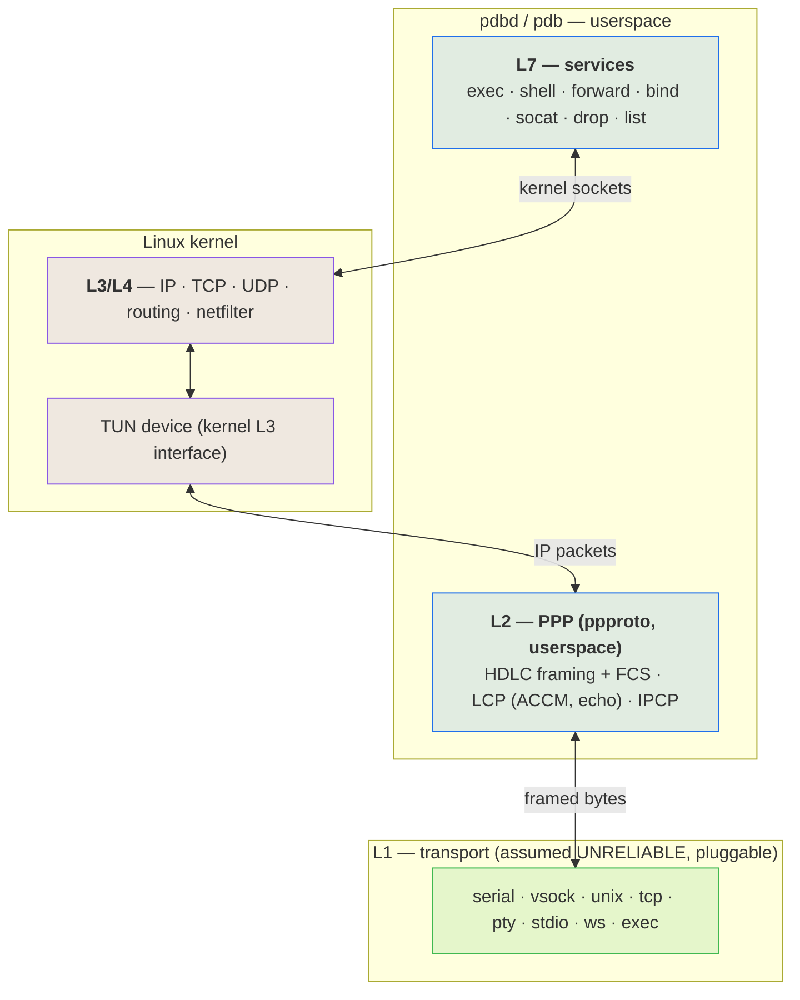
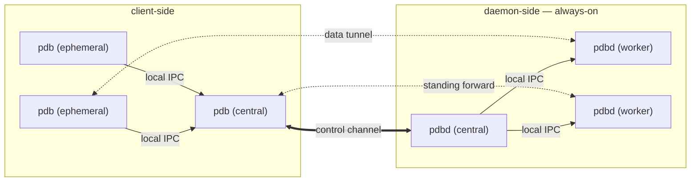
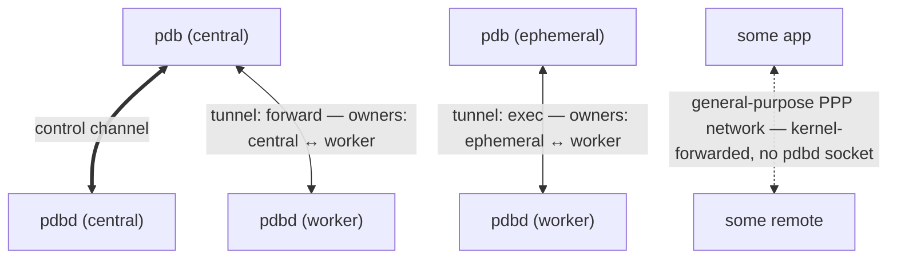
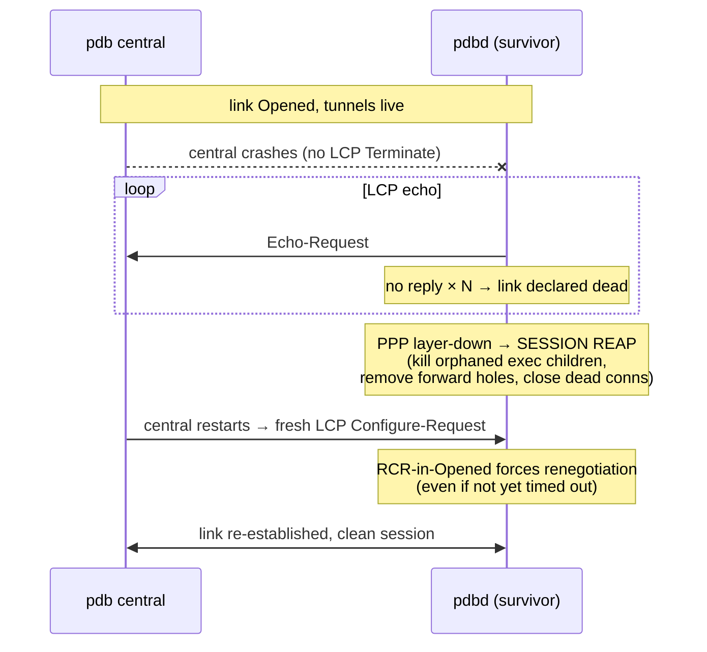

# pdbd

**A transport-agnostic, inject-and-play debug / RPC bridge — one daemon + one client that give you a reliable, multiplexed control channel, remote `execve`, and port-forwarding over *any* byte pipe, even when the pipe isn't reliable.**

> Status: **design / pre-implementation.** This README is the design spec. Nothing is built yet.

---

## Why this exists

Every tool that lets you reach into "the thing on the other side of a channel" is welded to *one* transport and *one* execution model:

| Tool | Transport | Execution |
| --- | --- | --- |
| `ssh` | TCP | shell / PTY |
| `adb` | USB / TCP | shell + `exec-out` |
| `qemu-guest-agent` | virtio-serial | `guest-exec` |
| `docker exec` | unix socket / API | shell / exec |

They solve the *same* problem — *run a process on the far side of a byte channel, forward some ports, maybe get an interactive shell* — four times, four ways, none of them interchangeable. And most of them are **shellful**, which is exactly why `ansible` and `terraform` fight their targets: a shell is not an RPC endpoint (quoting hell, `rc`/profile side-effects corrupting output, needs an interpreter on the target, no clean stdout/exit separation), and neither tool can reach a **console-only / serial** target at all.

`pdbd` collapses that into **one binary over "everything is a socket"**:

- **Any transport.** Serial, `vsock`, unix socket, TCP, a PTY, stdio, a websocket, or *any program's stdio* — selected with a [socat](https://www.redhat.com/en/blog/getting-started-socat)-style address.
- **Reliable even when the transport isn't.** The transport is assumed hostile and lossy *by construction* — a transport may be a noisy physical UART, a Serial-over-LAN link, or any channel that drops bytes, and "it happens to be a reliable `vsock` today" is never an assumption we're allowed to make. `pdbd` runs **PPP in userspace** to turn any dumb pipe into a real IP link, and lets the **kernel's TCP** carry reliability on top.
- **`execve`, not shell.** Structured `execve(argv[])` with stdio tunneled and a real exit code; a PTY *only* when you ask for `shell`. This is what makes it safe for automation and able to drive serial/console-only hosts the big tools can't.

`pdbd` is **transport- and OS-agnostic by design, meant to be reused across projects** — it is not built for any single one. The general job is **instrumenting and driving Linux images** — a VM guest, a container, or a bare-metal host — over whatever channel reaches them, including the awkward ones (a raw serial console, a Serial-over-LAN link) that `ssh`/`adb`/`docker exec` can't touch. The arc is a single bridge that unifies local-admin `ssh`, `adb`, guest agents, and `docker exec` — optimized for infrastructure use, over anything that looks like a socket.

---

## The layer model

The central idea: **`pdbd`/`pdb` own L1 (transport) and L2 (link), the kernel owns L3/L4 (IP/TCP/UDP), and `pdbd`/`pdb` own L7 (the services).** PPP in userspace bridges a dumb L1 pipe up to a kernel IP interface, so everything above L2 is *real kernel networking* — real sockets, real kernel TCP reliability, real `netfilter`.



### L1 — the transport (assumed unreliable, pluggable)

A dumb, bidirectional byte pipe. **We always treat it as lossy** — a transport may be a noisy physical UART or a Serial-over-LAN link that drops bytes, and a factually-reliable transport (a `vsock`, a unix socket) is never *assumed* reliable. The transport sits strictly *below* the tool.

Transports are named with a **socat / [websocat](https://docs.rs/websocat)-style address** whose `TYPE` encodes both the backend and the direction (connect vs listen), so no separate flags are needed:

```
--socket FILE:/dev/ttyS0,b115200,raw      # a physical UART / Serial-over-LAN device
--socket UNIX-CONNECT:/run/vm/guest.sock  # a VM host-end chardev socket
--socket VSOCK-CONNECT:3:9000             # vsock (cid:port)
--socket WS-LISTEN:0.0.0.0:8080           # websocket (insecure)
--socket WSS-CONNECT:host:443             # websocket-secure (TLS) — see Crypto
--socket EXEC:'ssh jump nc target 23'     # ride the link over ANY program's stdio
--socket STDIO                            # ride stdio
```

Each `TYPE` maps to an existing `AsyncRead + AsyncWrite` backend (`tokio` TCP/unix, `tokio-serial`, `tokio-vsock`, `tokio-tungstenite`+`ws_stream_tungstenite` for `ws`/`wss`), so L1 is largely assembly. `EXEC:` is the sleeper feature — the link can ride over anything that produces a pipe. `WSS` (and, situationally, `WEBTRANSPORT`) are the *secure* transports (see *Crypto*) — the only crypto-bearing L1 backends built in, because they mandate a complete, self-contained layering.

### L2 — PPP, in userspace

[`ppproto`](https://docs.rs/ppproto)-style **sans-IO PPP** runs HDLC framing (+FCS), LCP, and IPCP entirely in userspace. This is the part that makes a *lossy* serial usable:

- **Self-synchronizing, error-detecting framing** (HDLC flags + byte-stuffing + FCS) — after a corrupted byte it resyncs on the next flag and drops the bad frame, where a length-prefix framing would desync permanently.
- **LCP ACCM** — escapes control bytes a terminal/SOL link would otherwise eat.
- **LCP echo** — detects a dead/half-open peer, keeps an idle link alive, and triggers recovery (see *lifecycle*).

The negotiated IP packets terminate into a **kernel TUN device** — so PPP is done in userspace, but *IP and everything above it is the kernel's*. This backend needs only `CONFIG_TUN` (not kernel PPP), which maximizes portability. A **kernel-PPP backend** (`/dev/ppp`, kernel-side framing) is a future drop-in for performance: it relocates L2 into the kernel without changing L3/L4, so nothing above it moves.

### L3 / L4 — the kernel

Because L2 terminates into a TUN, the kernel runs its full stack on the link: real sockets, routing, `netfilter`, and — crucially — **kernel TCP carries reliability over the lossy pipe.** A frame corrupted on the wire fails FCS and is dropped; the TCP segment it carried is never ACKed; kernel TCP retransmits it. This is how TCP-over-PPP survived noisy modem lines for decades. One system (kernel TCP) gives us reliability, ordering, flow control, fair-sharing across tunnels, *and* the connection-teardown signal our cleanup rides on.

**Address discovery is free:** IPCP conveys each end's address to the other as part of link bring-up (and supports dynamic assignment — the dial-up heritage). So a client learns the daemon's control address from its *own* completed IPCP, regardless of whether that address was user-assigned or kernel-negotiated. No out-of-band discovery.

Because L2 is PPP terminating into a kernel IP interface, the link is itself a **general-purpose PPP network** — it provides ordinary L3 (IP) traffic over non-conventional L1 transports, so `pdbd`'s debug tunnels are just *one* consumer of it and arbitrary IP traffic can ride the same link. **Multi-IP, policy-routing, and firewall zones** then fall out of the kernel L3 interface for free (`ip addr add`, `ip route`, `nft`). These are *latent* — not built in v0, but the architecture leaves the door open to carve the single link into firewalled policy zones (control, forward, and the general-purpose network) later.

### L7 — the services

`pdbd` is, above the link, an RPC/debug agent. Commands: `exec`, `shell`, `forward`, `bind`, `socat`, `drop`, `list`.

- **`exec` vs `shell`.** `exec` is a structured `execve(argv[])` with stdio tunneled and a real exit code — *no shell, no PTY* (the automation-friendly primitive, like `adb exec-out`). `shell` allocates a PTY (`adb shell` / `ssh -t`). Each invocation is a *fresh, isolated process*, which is what eliminates the dirty-state problem a single shared console would have.
- **Control plane vs data plane — two different multiplexers.** The **control channel** carries lightweight RPCs (start / drop / list / events); its many concurrent logical streams are multiplexed by the **RPC framework itself** (see *Control plane*), never hand-rolled. Each command's **bulk** gets its **own** TCP tunnel — a separate kernel TCP connection, multiplexed by the **kernel** (4-tuple), *not* streams on one connection. Splitting the two is deliberate: bulk on per-connection kernel TCP avoids the HTTP/2-style cross-stream head-of-line blocking (the QUIC-vs-HTTP/2 lesson) that would couple unrelated tunnels on a lossy link, while the tiny control messages lose nothing to the RPC lib's stream mux.

### Process model

The two ends have **different** process constraints:

- **`pdb` (client-side) requires multiprocess.** Each `pdb exec …` you type is a distinct OS process; `central` is a separate singleton process; they coordinate over local IPC. The invocation model *forces* this — it cannot collapse to one process.
- **`pdbd` (daemon-side) is multiworker and does not require multiprocess.** Its hard requirement is a **connection owner per tunnel** (something holds the socket fd and drives it) plus **`execve` children**. The `execve` children do run as separate processes (`execve` replaces the image); the *connection owners* need not be — they may be `async` tasks, threads, or processes. Process-per-tunnel is a **choice for crash/exploit isolation** (a faulting tunnel can't corrupt the core — `sshd`-privsep's rationale), not an architectural requirement. An alternative-language `pdbd` may run a single-process worker pool — and if it instead runs a *multiprocess* pool, that core↔worker boundary becomes public wire (see *Control plane*).

Common to both ends: a small, long-lived **control-plane core** owns the link and the control channel, while volatile per-connection work lives in disposable workers (`sshd`'s process-per-connection, `adbd`'s per-stream model). Concurrency within a worker is `async` (tokio); isolation *between* tunnels is whatever boundary the impl chose.

---

## Topology & lifecycle

Modeled on `ssh`/`adb` — **client-side vs daemon-side**, never "host/guest" (on bare metal there is no host/guest, just two ends of a wire).



Heavy line = the single **control channel** (RPC); dotted = per-command **data tunnels**. **Every one of them is a separate kernel-TCP connection multiplexed over the one PPP link.** The **centrals** own the link and the control channel; the **connection owners** — an ephemeral (or central, for a standing forward) on the client, a worker on the daemon — each hold their own tunnel's socket fd, so bulk data never flows *through* a central. The parenthesised `(central)` is a **role**, never a command you type.

- **`pdbd`** — the daemon. **Always on**, daemon-side, idles waiting for a peer. The permanent endpoint.
- **`pdb`** — the client, in **two roles**:
  - **(ephemeral)** — the per-command invocations you actually run (`pdb exec …`, `pdb forward …`), each the connection owner of its own tunnel.
  - **(central)** — a **singleton** client-side process that owns the PPP link and the control channel, so the expensive, fragile link is established *once* and amortized, never rebuilt per command.

**Orchestration.** You only ever invoke an *ephemeral* `pdb`. On start it finds the running **central**, or — if none exists — **auto-spawns one** (exactly as `adb` auto-starts its background server) and attaches to it. Every ephemeral shares that single central. There is no `pdb central` command; central is spawned, discovered, and reaped implicitly.

**IPC.** ephemeral ↔ central speak over a **local IPC socket** (a unix domain socket). central owns the one PPP link and the control channel to `pdbd`; it is an **RPC router, not a byte relay** — it forwards each ephemeral's control calls onto the link and keeps the tunnel table, but stays *out* of the bulk data path. An ephemeral's own tunnel socket is owned by the ephemeral (see *Tunnel ownership*), so `exec`/`shell` bytes flow ephemeral ↔ `pdbd`-worker directly over kernel TCP, never through central. The ephemeral is a thin local client; central is where the link, the control channel, and the tunnel table live. The three control hops and the wire standard they share are detailed under *Control plane*.

**Lifecycle.** central's lifetime is **refcounted to the tunnel table — not to the number of ephemerals.** It exits when the active-tunnel count drops to zero, which brings the link down. So a standing `forward`/`bind` (a tunnel *owned by central*) keeps central alive after the ephemeral that launched it has exited, while an `exec`/`shell` tunnel dies with its ephemeral. (An idle-linger grace before exit is an option, to keep a warm link across bursts of activity.)

### Tunnel ownership

**All** TCP — `pdbd`'s debug tunnels *and* other traffic on the general-purpose PPP network — rides the kernel's TCP/IP. The difference is not a layer; it's **which process holds each endpoint socket.** Ownership is symmetric: every tunnel has a **connection owner at each end**, and the centrals stay out of the data path.



- A **debug tunnel** has a tunnel-id and a connection owner at each end: the daemon-side **worker** that `accept`ed/`connect`ed it, and a client-side owner — the **ephemeral** for an `exec`/`shell` tunnel, or **central** for a standing `forward`/`bind`. Each central keeps the *tunnel table* (for control + refcount); the owner holds the *fd*.
- **General-purpose PPP-network** traffic is kernel-forwarded IP with **no `pdbd` socket** — it never enters a tunnel table. It shows up only in the *kernel's* view (`ss` / `conntrack`).

Ownership needs no packet inspection: it's just which process holds the fd. The kernel does the TCP for everything regardless.

**Who holds the fd, and how it gets there.** The owning worker (a `pdbd` conn-worker, or a client-side ephemeral for its own `exec`) **opens its tunnel socket from creation** — directed over RPC ("accept/connect tunnel-id *X*"), it does the `accept`/`connect` and holds the fd itself. Nothing passes an fd across a boundary, which keeps every boundary portable and language-neutral: a cross-language or cross-host worker cannot receive a Unix `SCM_RIGHTS` descriptor. **fd-passing** (`SCM_RIGHTS`) is kept only as an **optional same-host optimization** — when central already holds a listening socket and both ends are co-located Unix processes — and is never part of the wire contract.

### Cleanup — reactive first, `drop` as a convenience

We never trust graceful signals (things die without notice). So the **kernel's TCP state is the cleanup oracle**: FIN / RST / keepalive-failure on a tunnel → `pdbd` reactively reaps that command's resources (kill the `exec` child, remove the `forward` hole). A **`drop <tunnel-id>`** command is the *explicit, graceful* teardown of a long-runner — it triggers the same reap path early, but it is **not** the safety net; the kernel is.

### Recovery from non-graceful termination

If `central` vanishes without an LCP Terminate (crash) while the pipe stays up, PPP is built to recover — it's the dial-up heritage:



Two native mechanisms do the heavy lifting: **LCP echo** detects the dead/half-open peer, and a **returning peer's Configure-Request forces renegotiation** even if the survivor hasn't timed out yet (RFC 1661 `RCR`-in-`Opened`). **PPP heals the *link*; `pdbd` heals the *session*** — it hooks PPP's layer-down event to reap orphaned children, firewall holes, and dead connections, so the returning `central` meets a clean daemon.

---

## Control plane — RPC, muxing & interoperability

The data plane is multiplexed by the **kernel** (per-tunnel 4-tuple) and `ppproto` (frames on the pipe) — settled, and no userspace muxer is pulled for it. What genuinely needs multiplexing is the **control plane**, which is **three segments**:

1. **pdb ephemeral → pdb central** — local IPC (UDS)
2. **pdb central → pdbd central** — over the PPP link (kernel TCP over the TUN)
3. **pdbd central → pdbd conn-worker** — local IPC (UDS), *present only when the daemon runs a multiprocess worker pool*

Each carries many small concurrent logical streams (start-exec, tunnel-opened, exit-status, list, drop, keepalive). None of it is hand-rolled: the multiplexer is the **RPC framework's own**.

### The interop requirement — a universal wire, not a Rust API

`pdbd`/`pdb` are a *reference* implementation. The wire must be a **standardized, language-neutral protocol with a published schema**, so independent reimplementations — `gopdbd`/`gopdb`, `jpdbd`/`jpdb`, `cpdbd`/`cpdb` — are **plug-and-play with each other and with this one**. A `cpdb` ephemeral controlling a `gopdb` central talking to a `jpdbd` central driving a Rust `pdbd` conn-worker must *just work*. That rules out any language-private RPC (e.g. a Rust-serde framing): the contract is the wire, and the wire is a standard.

This makes **segment 3 a public interface, conditionally**: a daemon that runs a multiprocess worker pool **must** speak the standard across it (so a `jpdbd` central and a Rust conn-worker interoperate); a single-process daemon has no such wire and legitimately opts out. The clean guarantee is **one standard service, with central and pdbd-central as routers that forward it** — then the worker boundary speaks the identical service for free.

### The choice

Two protocols satisfy "international standard + built-in mux + first-party implementations in every target language":

| Protocol | Wire | Mux | Multi-language |
| --- | --- | --- | --- |
| **gRPC** *(recommended)* | HTTP/2 + protobuf (CNCF) | **HTTP/2 streams — RFC 9113** | grpc-go, grpc-java, grpc C/C++ core, Python, C#, … — first-party; interop is its whole purpose |
| **Cap'n Proto RPC** *(alternative)* | Cap'n Proto wire + `rpc.capnp` | question/answer-id mux + promise pipelining (in-spec) | C++, Rust, Go, Java, Python |

**gRPC is the recommendation** — cross-language interop is the solved, boring case, and its mux (HTTP/2) is itself an IETF RFC. Cap'n Proto is the credible alternative (promise pipelining cuts round-trips on a high-latency serial link, and it is lighter than HTTP/2), with thinner multi-language RPC-layer maturity. A Rust-only RPC (`tarpc` et al.) is **disqualified** by the interop requirement, whatever its ergonomics.

> This is why gRPC/`tonic` is *not* in the rejected pile for the control plane. The HTTP/2 head-of-line concern applies only to carrying **tunnel bulk** — many high-throughput streams on one connection — which is exactly what the per-tunnel kernel-TCP design keeps *off* the RPC. Tiny control messages lose nothing to HTTP/2.

### The contract is a versioned schema

The artifact that makes cross-language real is a **published, versioned `pdbd.proto`** (or `.capnp`) defining the service — `Exec`/`Shell`/`Forward`/`Bind`/`List`/`Drop`, message types, streaming semantics. Every implementation codegens from it; it is a **published interface contract consumers depend on at a version**, not a transient file.

### Two standardized layers, stacked

The "control channel" is really two already-international standards on top of each other:

1. **PPP link control** — LCP/IPCP (`ppproto`), **RFC 1661 / 1332**: establishes the link, negotiates addresses, carries liveness.
2. **Application RPC** — gRPC + `pdbd.proto`, over kernel TCP, which exists only *after* IPCP brings up IP (so the RPC always rides a reliable stream).

The stack is therefore standard wire top to bottom: RFC-1661 PPP → kernel IP/TCP → RFC-9113 HTTP/2 → protobuf. A reimplementer has a spec for every layer.

### Why the data plane needs no muxer at all

A userspace mux (yamux, SSH channels, HTTP/2, adb's multiplexing loop) exists to run many logical streams over **one** connection *when the transport has no IP layer*. `pdbd` gives itself an IP layer (PPP → TUN → kernel), so each tunnel is just another kernel socket, demuxed by 4-tuple. The only scenario a data-plane mux would help is **TCP-tuple exhaustion** — and that is moot: on a point-to-point IPv4 link to one control endpoint only the source port varies (~64 k), but allocating **IPv6** (or binding multiple source addresses — which multi-IP-over-PPP already allows — and/or a `pdbd` holding multiple addresses) makes the tuple space astronomically larger than any host's fd / memory / scheduler budget. You exhaust **physical compute** long before the tuple pool, so a mux buys nothing the kernel does not already give.

---

## Bootstrap & the control channel

- `pdbd` is already running. `pdb central` comes up, brings up the PPP link, and **learns `pdbd`'s control address from its own IPCP** — no fixed address required, no out-of-band discovery.
- The control service binds the **IPCP-primary address** so it's the one IPCP conveys. Port is a configurable default (overridable), with a tiny announce/discovery exchange as the dynamic-port fallback. "Fixed" is a *default*, never an *assumption*.
- `pdbd` **programs its own firewall hole** for the control port (it holds `CAP_NET_ADMIN`), so it doesn't fight the firewall — it configures it. Everything after the control channel (forwards, exec) is negotiated *over* the control channel and provisioned on demand.

---

## Crypto

`pdbd` has **no crypto layer of its own**, by design. Security is either a **built-in secure *transport*** — one with a complete, self-contained layering the tool can own end-to-end — or **external wrapping** of an insecure transport. It is never a pdbd-implemented "encrypt my arbitrary L1" feature.

**Why the line falls between WSS and OpenSSL.** A built-in crypto-bearing transport has to be *fully specified*, so the tool knows exactly what it plugs into. **Websocket-secure mandates its whole stack** — WebSocket (L7) over TLS over TCP (L4) — a complete, standard, self-contained secure byte-stream with a defined handshake. **OpenSSL/TLS generically does not** — it is a general-purpose secure socket, usually over TCP but bound to no particular lower layer, with open-ended cert/cipher/verify policy. Owning that inside pdbd means owning all of that policy surface, and it has no single obvious shape. So **WSS (and, situationally, WebTransport) are built in; everything else secures externally.**

### Built-in — Websocket-secure (`WSS`)

The primary secure transport. TLS + cert verification come from the WS stack (`tokio-tungstenite` + `rustls`); pdbd just selects it as an L1:

```bash
# daemon
pdbd --socket WSS-LISTEN:0.0.0.0:443,cert=server.pem,key=server.key
# client
pdb  --socket WSS-CONNECT:gateway.example:443  exec -- uname -a
```

(Running pdbd's PPP/kernel-TCP over a TCP-based WSS is TCP-in-TCP — the standard caveat for any TCP-based L1, accepted for the uniform IP-link model; see *L1*.)

### Built-in — WebTransport (`WEBTRANSPORT`, situational)

WebTransport rides HTTP/3 = QUIC = **UDP**, so it needs UDP reachability and a younger Rust stack (`wtransport` on `quinn`). It is the secure transport for a QUIC-capable network, **not** a universal baseline — offered alongside WSS, never in place of it:

```bash
pdbd --socket WEBTRANSPORT-LISTEN:0.0.0.0:443,cert=server.pem,key=server.key
pdb  --socket WEBTRANSPORT-CONNECT:gateway.example:443  exec -- uname -a
```

### External — secure with OpenSSL (not built in)

For a plain TLS pipe, wrap the transport with the `EXEC:` escape hatch — `socat` or the `openssl` binary terminates TLS and hands pdbd a plaintext stdio pipe, so pdbd carries **no TLS code**:

```bash
# via socat OPENSSL
pdbd --socket EXEC:'socat - OPENSSL-LISTEN:4433,reuseaddr,cert=server.pem,key=server.key,verify=1'
pdb  --socket EXEC:'socat - OPENSSL:gateway.example:4433,verify=1'  exec -- uname -a

# via the openssl binary (s_server / s_client)
pdbd --socket EXEC:'openssl s_server -quiet -accept 4433 -cert server.pem -key server.key'
pdb  --socket EXEC:'openssl s_client -quiet -connect gateway.example:4433'  exec -- uname -a
```

### Baseline — insecure, over a trusted channel

On a trusted point-to-point pipe (local serial, `vsock`, unix socket) crypto is pure overhead and is simply omitted — the canonical `pdbd` deployment:

```bash
pdbd --socket FILE:/dev/ttyS0,b115200,raw
pdb  --socket FILE:/dev/ttyUSB0,b115200,raw  exec -- uname -a
```

So out of the box `pdbd` secures a WAN hop with **WSS / WebTransport**, secures an arbitrary pipe with **external OpenSSL via `EXEC:`**, and runs **bare on a trusted channel** — without ever growing a general-purpose crypto layer.

---

## Prior art

No single tool does what `pdbd` does — **transport-agnostic remote exec *and* a general IP path over the same arbitrary byte pipe** — but each half is well-trodden. Surveyed across languages (not just the C/Rust systems world) so we steal the right grammar rather than reinvent it.

**PPP, in userspace** — the L2 we need:

- [`ppproto`](https://docs.rs/ppproto) (Rust) — `no-std`, no-alloc, sans-IO PPP implementing RFC 1661 (LCP) + RFC 1332 (IPCP), tested against `pppd`. **Our starting point for L2** — sans-IO is exactly the shape that lets us feed it any transport.
- [Fuchsia PPP](https://fuchsia.googlesource.com/fuchsia/+/refs/heads/main/src/connectivity/ppp) (Rust) — PPP over serial with LCP/IPCP/IPv6CP; a fuller reference implementation.
- [`zouppp`](https://github.com/hujun-open/zouppp) (Go) — userspace PPP/PPPoE client with its own LCP/IPCP/IPv6CP state machines; the cleanest cross-language cross-check for our control-protocol logic.
- [`pppd`](https://github.com/ppp-project/ppp) (C) — the canonical reference for driving *kernel* PPP (GPLv2; we reimplement the grammar/behavior, never vendor the code, so `pdbd` stays permissively licensed).

**Userspace IP — the road not taken.** We terminate IP in the *kernel* via a TUN device (real sockets, kernel TCP reliability). The alternative — a userspace TCP/IP stack — is proven but heavier: [gVisor `netstack`](https://github.com/google/gvisor) (Go) and [`smoltcp`](https://docs.rs/smoltcp) (Rust). Recorded as the explicit fork in the design, not an oversight.

**Transport-agnostic remote exec / RPC** — the L7 we need:

- [`u-root`'s `cpu`](https://github.com/u-root/cpu) (Go) — plan9-`cpu`-inspired remote exec that carries namespaces over a flexible transport; **closest in spirit** to the exec half.
- [`gokrazy/breakglass`](https://github.com/gokrazy/breakglass) (Go) — inject a static binary into an otherwise-immutable appliance and get an interactive debug shell; the "break glass into a sealed image" use-case, which is exactly ours.
- [`eRPC` / EmbeddedRPC](https://github.com/EmbeddedRPC/erpc) (C/C++) — RPC explicitly decoupled from transport (serial, TCP, USB, RPMsg); the strongest prior art for *one RPC surface over many byte pipes*.
- [`citizenshell`](https://github.com/meuter/citizenshell) (Python) — one shell API over telnet / ssh / serial / adb; the clearest statement of the **unification** goal `pdbd` chases, from the scripting world.
- [Apache MINA SSHD](https://github.com/apache/mina-sshd) (Java) — a full SSH client+server *library* (not a CLI); the reference for SSH-as-embeddable-protocol rather than a daemon.

**L1 address grammar:**

- [`websocat`](https://docs.rs/websocat) / `socat` — socat-style address specifiers; the dialect reference for `pdbd`'s `--socket` L1 addresses (grammar *reimplemented*, never copied from GPL `socat`).

**Control-plane wire & mux standards** — what the interop requirement draws on:

- **gRPC** (HTTP/2 + protobuf, CNCF) / **Cap'n Proto RPC** — the two language-neutral RPC standards with built-in stream multiplexing and first-party implementations across Go/Java/C++/Python/C#/Rust; the interop contract (see *Control plane*).
- **HTTP/2 — RFC 9113** / **QUIC** ([`quinn`](https://docs.rs/quinn)) — the mux + connection-migration reference designs. QUIC is the honest alternative to the whole PPP-over-pipe stack (mux + migration + reliability, in userspace over UDP); **rejected** because it requires a UDP datagram substrate and `pdbd`'s premise is an *arbitrary, possibly non-IP byte pipe* (serial, pty, a command's stdio) — you can run PPP over `EXEC:'ssh …'`, you cannot run QUIC over it.
- [`yamux`](https://docs.rs/yamux) (libp2p) — a mature userspace stream multiplexer; the thing we **don't** pull, because the kernel IP layer makes it unnecessary.

**Multiplexing daemon & privilege separation** — the process-model prior art:

- **`adb`** — one binary is client *and* server, binds `localhost:5037`, **auto-starts the server if absent**, refcounts, and is "one giant multiplexing loop." The direct model for `pdb central`'s singleton / auto-spawn / refcount lifecycle.
- **OpenSSH privilege separation** — a privileged monitor + unprivileged, disposable per-connection children with a narrow op-set across the boundary; the model for the core-vs-worker split.

**Roaming / recovery from a dead peer:**

- **Mosh / SSP** — stateless UDP roaming (highest-seq authentic packet re-targets the peer; ≤3 s heartbeat; survives IP/NAT change). The comparison point for our LCP-echo + RCR-in-Opened recovery — Mosh does it at L4 with sequence numbers; we do it at L2 with PPP while kernel TCP tunnels ride on top.
- **QUIC connection migration** — connection-IDs route across a changed 5-tuple; the same recovery goal solved at the transport layer (and UDP-bound, as above).

**Port-forward / tunnel fleet** — the `forward`/`bind` prior art:

- [`russh`](https://docs.rs/russh) (Rust) — exposes `direct-tcpip`/`forward-tcpip` + unix-socket forwarding; the embeddable-SSH reference for the forwarding primitives.
- **rathole** (Rust, 14 k★), **bore** (Rust, 11 k★), **chisel** (Go, 17 k★, tunnel-over-HTTP), **frp** (Go, 110 k★) — the NAT-traversal tunnel fleet; prior art for port-forward UX and reverse tunnels (none transport-agnostic the way `pdbd` aims to be).

**The tools this unifies:** `adb`, `ssh`, `qemu-guest-agent`, `docker exec` — each solves one transport or one capability; `pdbd` is the single endpoint that spans them.

---

## Libraries

Candidate Rust dependencies, by layer — versions verified against crates.io on 2026-10-04.

**L2 — PPP:**

- [`ppproto`](https://crates.io/crates/ppproto) `0.2.1` — sans-IO PPP state machine (LCP + IPCP). Primary L2 engine. HDLC framing + FCS are internal to it; a standalone [`hdlc`](https://crates.io/crates/hdlc) `0.4.1` is the fallback only if we drive framing ourselves.

**L3 — TUN device:**

- [`tun-rs`](https://crates.io/crates/tun-rs) `2.8.11` — cross-platform TUN/TAP, async-capable; broadest device support. Preferred.
- [`tun`](https://crates.io/crates/tun) `0.8.14` / [`tokio-tun`](https://crates.io/crates/tokio-tun) `0.15.2` — leaner Linux-first alternatives if we don't need the portability surface.

**L1 — transports (pluggable):**

- Serial: [`tokio-serial`](https://crates.io/crates/tokio-serial) `5.5.0` (async, over [`mio-serial`](https://crates.io/crates/mio-serial) `5.0.7` / [`serialport`](https://crates.io/crates/serialport) `4.10.1`) — the v0 transport.
- vsock: [`tokio-vsock`](https://crates.io/crates/tokio-vsock) `0.7.2` — the VM-guest transport.
- WebSocket (`ws`/`wss`): [`tokio-tungstenite`](https://crates.io/crates/tokio-tungstenite) `0.30.0` (establishes `ws://` and, with [`tokio-rustls`](https://crates.io/crates/tokio-rustls) `0.26.6`, `wss://`) + [`ws_stream_tungstenite`](https://crates.io/crates/ws_stream_tungstenite) `0.15.0` (adapts the WebSocket to `AsyncRead`/`AsyncWrite`). `wss` is the primary built-in **secure** transport (see *Crypto*).
- WebTransport (`webtransport`, situational secure): [`wtransport`](https://crates.io/crates/wtransport) `0.7.2` — WebTransport over HTTP/3 on `quinn`; needs a UDP substrate, so it is offered alongside `wss`, not as a baseline.

**Kernel plumbing:**

- [`rtnetlink`](https://crates.io/crates/rtnetlink) `0.23.0` — program routes/addresses on the TUN from the IPCP-negotiated values, without shelling out to `ip`.

**Control plane — RPC (language-neutral; see *Control plane*):**

- [`tonic`](https://crates.io/crates/tonic) `0.14.6` — gRPC/HTTP-2; **recommended** for the three control segments. Its HTTP/2 stream mux *is* the control-plane multiplexer, and the wire is a CNCF standard with first-party implementations in every target language.
- [`capnp-rpc`](https://crates.io/crates/capnp-rpc) `0.27.0` — Cap'n Proto RPC; the alternative (promise pipelining, lighter than HTTP/2).

**Process model (daemon workers + exec):**

- [`nix`](https://crates.io/crates/nix) `0.31.3` — `fork`/`execve`/`waitpid` and the raw syscalls the worker + exec model needs.
- PTY (for `shell`): [`portable-pty`](https://crates.io/crates/portable-pty) `0.9.0` (wezterm, cross-platform, mature) or [`pty-process`](https://crates.io/crates/pty-process) `0.5.3` (tokio-native).
- [`interprocess`](https://crates.io/crates/interprocess) `2.4.4` — async cross-platform local IPC (UDS + named pipes) for the ephemeral↔central socket, if not reusing the RPC lib's own UDS transport.
- [`sendfd`](https://crates.io/crates/sendfd) `0.4.5` / [`anchovy`](https://crates.io/crates/anchovy) `0.4.1` (async) / [`command-fds`](https://crates.io/crates/command-fds) `0.3.3` — `SCM_RIGHTS` fd-passing, for the **optional same-host** tunnel-handoff optimization only (not the portable default; see *Tunnel ownership*).

**Considered and rejected:**

- [`yamux`](https://crates.io/crates/yamux) `0.14.1` / [`tokio-yamux`](https://crates.io/crates/tokio-yamux) `0.3.20` — userspace stream multiplexer. Unnecessary: the kernel IP layer multiplexes the data plane by 4-tuple, and the RPC framework multiplexes the control plane. We never carry many logical streams over one connection ourselves.
- [`quinn`](https://crates.io/crates/quinn) `0.11.12` (QUIC) — bundles mux + migration + reliability, but requires a UDP datagram substrate; incompatible with `pdbd`'s arbitrary-byte-pipe premise (serial, pty, `EXEC:` stdio).
- `tarpc` — Rust-/serde-private RPC; **disqualified by the interop requirement** (no language-neutral wire a `gopdb`/`jpdb` could target).
- **gRPC for tunnel *bulk*** — gRPC is recommended for the control plane but rejected for carrying tunnel bulk: many high-throughput streams on one HTTP/2 connection reintroduce the cross-stream head-of-line blocking the per-tunnel kernel-TCP design exists to avoid.

---

## Scope

**v0 (the core):** a daemon + client, userspace-PPP + TUN over a serial transport, the control channel, and `exec` + `forward`.

**Later:** kernel-PPP backend, `vsock`/`ws` transports, multi-IP zones on the general-purpose PPP network, pluggable auth — and the broader `ssh`/`adb`/`docker`-unification arc.

**Interoperability (a first-class goal, not an afterthought):** a published, versioned `pdbd.proto` is the cross-language contract. Independent reimplementations — `gopdbd`/`gopdb`, `jpdbd`/`jpdb`, `cpdbd`/`cpdb` — are meant to be **plug-and-play** with this reference impl and each other, mixing freely across the three control segments (see *Control plane*). An alternative daemon may skip a multiprocess worker pool; if it keeps one, that boundary must speak the standard wire.

**Per-deployment:** environment specifics — e.g. the guest kernel's `CONFIG_TUN`, or whatever a mandatory-access-control policy on an enforcing host must grant the daemon so it can create its TUN and program `netfilter` — are a property of each use case, not of `pdbd` itself.

---

## License

**MIT** — see [LICENSE](LICENSE). The socat-style address grammar is *reimplemented*, never copied from GPL socat (an interface/grammar isn't copyrightable; the implementation is).
